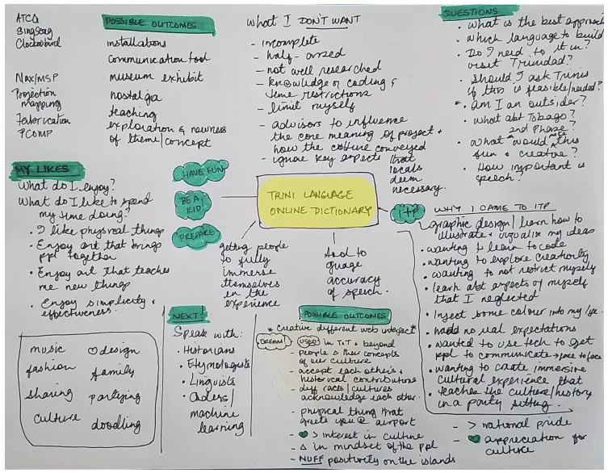

_Originally published at on Medium in on April 20, 2019._

In conversation with ITP SIRs Nikita Huggins & Ayodamola Okunseinde
-------------------------------------------------------------------

In 2019 the conversational pairing of diversity and machine learning largely results in rediscoveries of biased societal patterns but the subject matter offers much more nuance to be explored. This redundant rhetoric needs more heart, more compassion and, before all else, more creative applications that nudge us to be self-reflective as a united community and empower underprivileged voices. As a creative technologist and woman of colour, I look to the work of black speculative designers who are leading these innovative conversations. At the helm of this challenging navigation are two artists who seem to be eloquently articulating all the questions that are on the collective tip of our tongue.

[Ayodamola Okunseinde](http://ayo.io/) is an award winning Afrofuturistic Reclamation artist, designer, and technologist whose work questions and connects the past, present and future for underrepresented communities. His masterful way of problematizing relationships between physical and virtual environments has garnered a body of knowledge that not only humanizes technological spaces but also forces positive dialogue through the contemplation of speculative futures, prototyping elements of the present that can be leveraged for social change.

With a keen eye on etymology and the preservation of cultural language, [Nikita Huggins](http://www.nikitahuggins.com/) is a researcher and creative technologist whose work centers social impact and digital self-exploration. She asks the hard questions — _“if Google translate is for everybody than why can’t it understand my dialect?”_ Her work persists to hold tech accountable and queries the norms that we have established in our daily use.

As active educators of marginalized populations, both artists work, in part, to bridge the gap, bringing forward youth who will go on to mindfully diversify the tech industry. As a team, operating under the name [C.T.R.L. Alliance](http://www.ayo.io/ctrl.html), they have shared an ml5 focused [Something in Residency](https://tisch.nyu.edu/itp/itp-people/faculty/somethings-in-residence-sirs) position at ITP this semester. I sat down with Ayo and Nikita to discuss their intentions for the term and had the pleasure of discovering the breadth of considerations that go into their practice.

If you like this conversation as much as I do, then you’re in luck! Nikita and Ayo have generously agreed to one more Medium check-in at the end of the semester!

> — [Ashley Jane Lewis](https://twitter.com/ashleyjanelewis), 1st year ITP student and ml5 Community Manager Research Assistant

**ml5:** It’s thrilling to speak to you about the creative and artistic ways that you’ll be investigating machine learning. The ITP student body is excited to learn about the method of looking through the lens of representation in order to rally new voices that haven’t usually be at the table. What is the goal of the residency as it stands right now?  

**Nikita:** Ayo and I are working together to create _Black Corpus_, a project under [C.T.R.L. Alliance](http://www.ayo.io/ctrl.html), our collaboration that investigates culture, language, research and technology. We’ve created several installations, one of which was at [playtest](https://www.playtest.org/) at the Library of Congress. We’re interested in the deeper meaning of words and we think that working with machine learning would be a good opportunity to analyze the written works of black authors to potentially reveal an additional layer of subtext.

We have three major goals of the SIR. First, we’re aiming to draw out elements from our findings that could then be represented or showcased to the public. Secondly, we’ve developed a prototyping workshop for ITP that walks students through the process of designing data sets while considering issues around gender and racial bias. The last ambition is to contribute to ml5 by creating new, unexplored models. Ayo and I are planning to work with Temple University to get our data sets. They’re developing a corpus of literary works including those by authors of colour. With this partnership we’ll be able to collect the data, train models and then put them on ml5 so that the greater public can have access to them.

**ml5:** Since you can train models on a variety of different kinds of data, the idea of using language specifically is very interesting to me. What inspired the decision to focus on texts by black authors?  
Nikita:** I guess because it was missing.

**Ayo:** Yeah. _\*laughs\*_

**Nikita:** It stemmed from a conversation where we sat down and asked, “_how do we fit into this?”_ At the time I was working with the [Trinidad Creole](https://en.wikipedia.org/wiki/Trinidadian_Creole) language for my thesis. Words just felt particularly meaningful. We did some research and found that you can get a whole corpus from a British author. It’s online because someone bothered to scrape it, but no one is doing it for us. The classics are great but sometimes you reach a point where you just need to see something that is more representative of yourself. Show me something I can relate to! We saw that others were using these common text generation examples to derive additional meaning from the literature which got us thinking, _“can we discover new meaning from the authors that matter to us as well?”_ It’s about the idea that if you want to see something in the world you need to create it.

**Ayo:** I have to give credit to ml5 as well. Before ml5, I thought about exploring machine learning projects and I even tried taking classes on the subject but there wasn’t the same the ease and access. ml5, with its web enabled editor, can be taught without the steep learning curve. The examples on the website really sparked my interest. One of the first ones that I looked at was the Virginia Woolf LSTM, followed by the Ernest Hemingway LSTM. Around that time, Nikita and I were speaking about collaborating and, in our exploration, we realized, _“wait, where’s the_ [_Langston Hughes_](https://en.wikipedia.org/wiki/Langston_Hughes) _LSTM? Where are the_ [_W.E.B Du Bois_](https://en.wikipedia.org/wiki/W._E._B._Du_Bois) _examples?”_

**ml5:** Yeah, you two are really piloting that content.  

**Ayo:** I was very inspired by those models and I want people to be inspired by models of different authors. Creating black examples also perpetuates their work, cycling their text back into a modern context. It would be great to see what could come from that.

**ml5:** I don’t see many demonstrations of machine learning that pertain to blackness right now, which, of course, is at the root of your creative pursuit. Are there other examples of data sets or collectives that are trying to build this kind of content?  
Ayo:** We’re not familiar with other groups that are creating _artworks_ based on machine learning about blackness or language. The reason we wanted to look into machine learning is that it is literally this other kind of mind that has its own understanding of the world.

> The way it manifests itself is a space that, as people of colour, we haven’t had a lot of access to. We want to explore its accessibility but also what it means for a machine to taste blackness, in a sense.

Is there something within the text that can be transferred and understood through the machine that may not be understood otherwise? Similar to the work of [Stephanie Dinkins](https://www.stephaniedinkins.com/), we’ll be trying to coax a personality into a machine and then query its understanding of itself as a black entity.

**ml5:** That’s amazing. I’ll probably be ruminating on the idea of “tasting blackness” for a long time. There’s such personification in that phrasing and it really presumes an identity for the machine. If this is its first taste of blackness, what is the machine’s identity right now?  
Ayo:** I would argue that the machine’s current identity or rather the flavours within it now are very “tech bro” in classification. The identity is not diverse enough, not only in blackness but in gender, in approach, in understanding other epistemologies, you know? From my understanding and research of the works that I’ve seen come out of machine learning, it’s still struggling to take all of those elements into consideration, which is a direction it will have to venture in order to address the societal issues that the field is dealing with right now. Truthfully, current projects that address critical issues of racism and bias can be stark and sometimes sterile. We’ve seen few examples that have approached these topics in nuanced, speculative or poetic ways.

**Nikita:** You’re right, there are lots of articles about bias towards people of colour, gender, sexuality and the like. The approach is almost repetitious. Yes, it’s important to discuss the impact of machine learning on policing but what about everything else?

**ml5:** These are prominent story arcs. They’re very easy to tell but this kind of siloed approach is such a common flaw in the translation of stories about blackness. The undercurrent reality is far more multifaceted and certainly more expansive and expressive than just these narratives.

**Ayo:** Right. There can be and are many intersections of blackness and machine learning to be explored. For example, what does [Octavia Butler’s](https://en.wikipedia.org/wiki/Octavia_E._Butler) work tell us about black bodies that we may not be able to gain through the medium as it stands? What does Octavia Butler’s work, now combined with Langston Hughes, or W.E.B Du Bois, tell us about the condition of blackness? Is it possible to read even deeper into these texts by using algorithms to sort and parse out the spaces that we may not be able to grasp just by the sheer fact that we’re saturated by the norms of our societal mores and ways of thinking? Is there, perhaps, a way to ask a machine to reinterpret and reconsider those structures?

**Nikita:** Based on the outcomes that we get, we’ll discover questions for ourselves, like whether we should we even try to recreate the algorithm to be more inclusive.

**ml5:** Or does blackness need its own system entirely?  

**Nikita:** Right, is there an alternate space that needs to be built for inclusivity to be taken into consideration? Is it more than just a diversity issue? Is the algorithm itself inherently biased?

**Ayo:** Some of our other works have spoken to these kinds of questions. For example, in our piece _Unbroken Meaning_, we put Trinidad English Creole and [Nigerian Pidgin](https://en.wikipedia.org/wiki/Nigerian_Pidgin) into the model. It then tries to understand what the language is, which is obviously a flawed pursuit because the model was developed in English. Once it has finished processing, it speaks the language out to us. Our questions are around what is gained and what is lost in the process of taking a deeply rich language and passing it through a sterile sieve. Is it possible to create a system that not only understands Pidgin and Creole but also puts it into context?

These languages come out of an ontology that is derived from a particular African or West African epistemology, which is in turn based on a cosmology that provides an understanding of the world. The ways in which this informs behaviours, thought processes and conversations are very interesting to explore because it often requires us to analyze the double meaning of phrases and words. A lot of these languages rely heavily on mythological parables and metaphors. It’s storytelling and there’s context within the language which shifts the meaning.

> Let’s not forget the intentionality in that; the idea that the patterns of these languages exist to obfuscate and create distance between an oppressor and the oppressed group.

I don’t know if a machine can understand that. In some ways it’s obvious that, of course, a machine could never understand that, but it’s worth investigating.

**ml5:** It sounds like this work is just as much about parsing a nuanced language as it is about spending the time to appreciate and rediscover that language.  

**Nikita:** Exactly. In that process we’re unveiling parts of history and examining power structures — there’s so much to unpack. What we also hope to find through this work is an examination of those constructs for ourselves and our own self-identification. Hopefully this can help inform other black people as well.

**ml5:** By making these kinds of machine learning examples available, it may cause a ripple effect, inspiring young black creatives to continue making identity based content of their own.  
Nikita:** Definitely. A few weeks ago I taught an ml5 workshop to a class of high school students. They really enjoyed the conversation about algorithmic bias but when I told them that you could use lyrics or poems to train an LSTM model you could see the creativity flowing.

**Ayo:** I actually have a student at Parsons who has started working on an ml5 LSTM. She’s trained a model on Cardi B lyrics _\*laughs\*_. Of course that’s not a big body of text and what comes out of it is sometimes questionable, but at least that’s a start! With young people in particular, machine learning is a good tool to start discussions about bias, ownership and access. If is that’s all these projects do, then that’s a lot!

There’s one really important consideration that we haven’t discussed yet. Hmm how do I express it? It’s extremely important that we engage mindfully with this content because certain authors have more privilege than others. For instance, when you run a Hemingway model and it outputs garbage or gibberish that’s okay, right? That doesn’t change the way we idolize Hemingway. That doesn’t shift our impression of his content because his work, along with the likes of other common text generation authors like Shakespeare or Victoria Woolfe, are canonized. However, if you run the works of [James Baldwin](https://en.wikipedia.org/wiki/James_Baldwin) through a model and it outputs nonsense, that’s not okay. There’s a lack of representation already and there is a lot misrepresentation of blackness out there. One doesn’t want to add to that. One doesn’t want to leave space to perpetuate stereotypes.

Hemingway has a privilege of being able to be battered and misrepresented, without great consequence because we’ve been taught that Hemingway is quality stuff. Langston Hughes, [Malcolm X](https://en.wikipedia.org/wiki/Malcolm_X), Octavia Butler however… _we_ \[people of colour\] know that it’s quality stuff but a lot of people don’t even know their works. It’s precious and it can be bruised or damaged very easily. That’s the best way I can describe it.

**ml5:** It’s a common paradox for black creative technologists. Do you create content that diversifies monocultural tech spaces or preserve the sanctity of black culture to avoid appropriation or misuse?  

**Nikita:** It’s complicated. In part, that’s why we’re hoping to bring other artists of color who are in the machine learning field to ITP. It would be meaningful to host panels or artist talks to hear their perspective and learn about their approach. That might also help us develop ideas for the art we’re trying to make in this residency.

**ml5:** I’m looking forward to is how all of this research for _Black Corpus_ will manifest artistically! You’re working with so many cerebral concepts and playing with a lot of tangible tools. What will the visuals look like? Will they be screen based or physical installations?  

**Ayo:** I think moving away from the screen based and leaning more towards physical objects. Something utilitarian, meaning that they won’t be purely aesthetic wall or table decorations. We’re modelling the traditions of West Africa art \[like masks and instruments\], which are aesthetically beautiful but also meant to be engaged with, worn, touched. I think it’s important for our artworks to live in physical spaces and be interacted with.

**ml5:** That sounds very exciting! Let’s end on something introspective so that we have a topic to lead the conversation when we interview you at the end of term. What is the question you’re posing the artwork today  
Ayo:** For me, it’s _what is the work going to look like?_ In my head I have a vision of everything up to the manifestation of the work.

**Nikita:** I think that’s why we came up with the workshop. It will tangentially help us with the design process. My question is _will the art be truly representative or is it going to be simply our interpretation of blackness?_

**Ayo:** _Is it really going to make an impact?_ It has to be something good. It has to be a portal bridging two worlds.

**Nikita:** _Is the algorithm going to do it justice?_ Which will lead to a bigger discussion of _why or why not?_

**ml5:** The main thing is just to be asking (and attempting to answer) those questions. The more questions you pose publicly through the application of this residency, the more questions we will get. Ultimately this opens the doors for other people to pick through those queries and begin to tackle them via their own creative practice. Thank you so much for sharing so open-heartedly about your intentions for this SIR. ITP and ml5 are very lucky to have you this semester.**

Follow [Ayo](https://twitter.com/aokunseinde) and Twitter and Nikita [online](http://www.nikitahuggins.com/) and stay tuned for the end of term posts in this series!