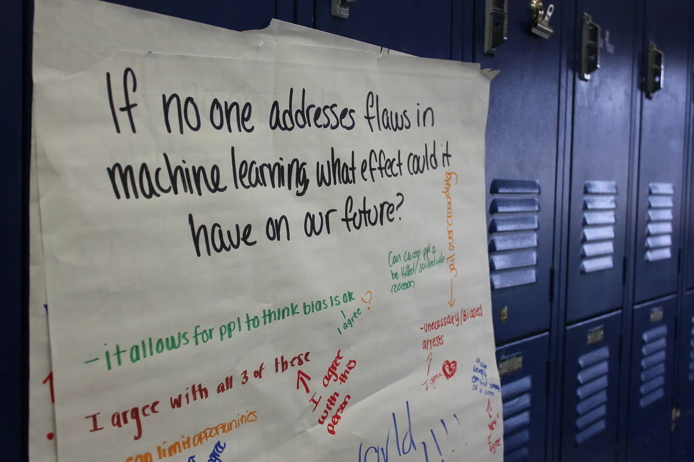

_Originally published at on Medium in on May 10, 2021._

Today we are excited to announce two new parts of ml5.js: a new and improved [Code of Conduct](https://github.com/ml5js/Code-of-Conduct) and our very own [software license](https://github.com/ml5js/Code-of-Conduct/blob/main/LICENSE.md). These are part of our ongoing work to make machine learning for the web _friendlier_. This blog post explains how these parts work and how we got here.

For more than a year now, we have been working to understand a central question: how can we use the rules that govern the ml5.js community to encourage friendly, creative applications of machine learning?

In January 2021, after a year of internal discussion, we asked for [community feedback](https://medium.com/ml5js/ml5-js-code-of-conduct-4eb8fcae1ef7) on a draft version of a Code of Conduct and software license for ml5.js. We explained that our goal was to keep ml5.js grounded in the spirit of open source, while reducing the chance that ml5.js could be abused for purposes we feel run counter to the expectations of the ml5.js community.

Since then, we received feedback through a number of open channels (for example, [Github issues](https://github.com/ml5js/Code-of-Conduct/issues) and [Discord](https://discord.com/invite/FTEsREKNtb)) as well as through more directed, one-on-one conversations and feedback sessions (such as meetings with experts in creative technology, machine learning, community development, and open source). We have integrated that feedback into today’s versions of the Code of Conduct and software license.

The Code of Conduct and software license work together to affirm the importance of our neighborly approach to creating and exploring machine learning. This neighborly approach means a recognition of one another, extending care for the people around us and the places that we touch through the things we make — in this case through machine learning. Our Code of Conduct and software license are a recognition of the fact that machine learning is a powerful tool; it is as much about math, statistics, and data, as it is about the ways that power is employed in the world. It can be used for creative exploration that surprises and delights and improves the world. Unfortunately, machine learning can be employed (knowingly and unknowingly) to bring harm to real people, places, and things. We’d like to do our best to minimize these negative effects as much as possible.

The Code of Conduct describes how we expect everyone to behave while they are in shared ml5.js community spaces. Additionally, the software license requires projects that incorporate ml5.js to follow the rules of the Code of Conduct.

The Code of Conduct
-------------------

The ml5.js [Code of Conduct](https://github.com/ml5js/Code-of-Conduct) describes the expectations for how everyone behaves within the ml5.js community. That includes community spaces like workshops, GitHub repositories, and online discussion areas.

The Code of Conduct draws inspiration from and builds upon community statements and codes of conduct from the open source and creative arts community, such as the [p5.js community statement](https://p5js.org/community/) and [code of conduct](https://github.com/processing/p5.js/blob/main/CODE_OF_CONDUCT.md#p5js-code-of-conduct). It also includes examples of welcome and unwelcome behavior while building projects with the ml5.js library and while in ml5.js community spaces.

It is important that members of the ml5.js community know that the Code of Conduct is an active part of the community. That is why it includes information about asking how your project matches up with the Code of Conduct’s expectations, how to report possible violations, and about how we will handle those allegations.

We know that ml5.js continues to evolve, and that the ways in which machine learning can be used for learning and creativity are hard to anticipate. That is why we have designed the Code of Conduct to be a living document.

We expect the Code of Conduct to evolve in at least two ways. First, we know that the text may change. This could involve adding, removing, or editing some of the expectations from the document.

Second, the Code of Conduct balances being broad in its scope with the need to provide clarity should specific situations occur that break or violate the Code of Conduct. We hope that these situations are uncommon, but we do believe that the Code of Conduct will help all ml5.js community members to understand the ml5.js rules and expectations. We will work to make these situations — e.g. the process of addressing breaches in the Code of Conduct and how we resolve them — public so that the entire community understands how the Code of Conduct works. We expect that these situations will help our collective understanding of the Code of Conduct evolve over time.

Code of Conduct Committee
-------------------------

The Code of Conduct Committee’s job is to help guide the Code of Conduct’s evolution and help apply its general rules to specific situations. The initial Code of Conduct Committee is made up of:

*   Christina Dacanay
*   Lydia Jessup
*   Sam Krystal
*   Joey Lee
*   Ashley Jane Lewis
*   Bomani Oseni McClendon
*   Daniel Shiffman
*   Michael Weinberg

The Code of Conduct Committee is responsible for enforcing the Code of Conduct. It is also responsible for making sure that the Code of Conduct Committee is sustainable and represents the ml5.js community.

For now, that means that we expect at least some members of the Code of Conduct Committee to rotate off every year. That gives Code of Conduct Committee members a chance to step away from their responsibilities and provides an opportunity to new members of the ml5.js community to take part. The Code of Conduct Committee also intends to explore ways to make it easier to participate. That includes defining sustainable workloads and seeking grants to recognize the labor required to be part of the Committee.

The License
-----------

The new [ml5.js software license](https://github.com/ml5js/Code-of-Conduct/blob/main/LICENSE.md) uses copyright law to require projects to follow the Code of Conduct. Using ml5.js requires you to promise that your project follows the Code of Conduct. Our license is a modified version of the [Blue Oak Model License 1.0.0](https://blueoakcouncil.org/license/1.0.0), which is a modern permissive license.

Although ml5.js is far from the first project to explore ethical licensing, there are a few elements of this new approach that we want to take a moment to explain.

Separate the License from the Code of Conduct
---------------------------------------------

One of the hardest parts of designing an ethical open source license is finding a way to describe what is considered “acceptable” use under the license. Instead of trying to describe all of these “good” and “bad” uses in the license text, we are linking the license to our evolving Code of Conduct.

We think this helps in a few ways. First, the Code of Conduct is easier to read for most members of the ml5.js community, who are not formally trained as lawyers. We hope that makes it more approachable than immediately asking our community members to parse through formal legal language.

Second, it allows the rules around behavior to evolve without having to revise the license itself. It is easier to update the Code of Conduct than it is to try and revise licensing language.

Empower the Code of Conduct Committee to Review Alleged Violations
------------------------------------------------------------------

The Code of Conduct is broad, and there are many ways that people might use ml5.js. We do not want creators to worry that a misunderstanding about how the Code of Conduct applies to a specific project could result in a violation of the software license. The Code of Conduct Committee must investigate and agree that a project violates the Code of Conduct before the project formally violates the license. We hope that this will make it more likely that the Code of Conduct will be enforced fairly.

License Decay
-------------

Copyright protection can easily last for over 100 years. That means a poorly thought out software license can create problems for decades into the future. We have incorporated decay into our license in order to try and avoid these types of problems.

The ml5.js library is made up of thousands of individual commits (in Git terms) by individual contributors. For the first three years after each commit is made, that commit will be licensed under our new software license, which will require users to comply with the Code of Conduct. That means that versions of the ml5.js library that include commits created in the last three years are covered under the license. If you are using a version of the ml5.js library that has been updated in the last three years, you are also bound by the software license. After three years, the license decays into the very permissive [Blue Oak Model License 1.0.0](https://blueoakcouncil.org/license/1.0.0).

In practice, this means that an actively developed ml5.js will be licensed under the ml5.js software license because some of its components will always be less than three years old. Projects that use the current version of the library will be required to comply with the ml5.js Code of Conduct. However, the decay helps us address three concerns involved with trying out our newly developed, ml5.js-specific software license.

**Concern #1: The license relies on an active Code of Conduct Committee.** The first danger is what would happen if ml5.js was abandoned by the community. The ml5.js software license does not really work without an actively developed Code of Conduct and Code of Conduct Committee to oversee it. License decay means that the Code of Conduct will no longer be binding three years after the last commit if the Code of Conduct and Code of Conduct Committee are no longer active.

**Concern #2: The Code of Conduct could evolve in unexpected ways.** The second danger is what would happen if the Code of Conduct evolved in a way that parts of the community were no longer comfortable with. In this case, that part of the community can rewind to three years before the change, fork the project, and move in a different direction. This also means that project creators do not need to worry about a change to the Code of Conduct years after they create their project. After three years, the old version of ml5.js used by an archived project will no longer be legally required to comply with the Code of Conduct as it evolves.

**Concern #3: We want to account for our own learning.** The third danger is simply that this new approach to ethical licensing turns out to not work as intended. The license decay feature makes it much easier to change course if we need to do so.

Is ml5.js Still Open Source?
----------------------------

The ml5.js community is rooted in open source approaches to software development. ml5.js is built on other open source software — the machine learning functionality and pre-trained models of ml5.js are built entirely on top of TensorFlow.js, the JavaScript implementation of Google’s end-to-end open source ML platform Tensorflow licensed under Apache-2.0 License — and is developed in an open, collaborative manner.

We understand that there is an ongoing discussion in the open source software community around how ethical concerns might be integrated into open source software licenses. We understand that incorporating ethical concerns into open source licenses violates the terms of the [Open Source Definition](https://opensource.org/osd) maintained by the Open Source Initiative. That may mean that some people will no longer view ml5.js as open source software. As we wrote in our [call for comment](https://medium.com/ml5js/ml5-js-code-of-conduct-4eb8fcae1ef7), we respect the fact that different parts of the community view this question differently.

As a community, we remain committed to developing ml5.js in a way that is open, inclusive, and encourages others to use, build upon, and remix the library. We have also decided that the cost of losing some users who are uncomfortable with our approach to an ethically-grounded license is outweighed by the importance of building a community focused on ethical uses of machine-learning. There are many alternatives to ml5.js for those who are not interested in our approach.

Can Other People/Projects Use This Approach?
--------------------------------------------

Yes please!

Our approach builds on the work of many others. We encourage everyone to take what they want from it. Use this approach as a starting point, copy it exactly, or whatever else makes sense for you.

The Code of Conduct is licensed under a [Creative Commons public domain dedication](https://creativecommons.org/share-your-work/public-domain/cc0/). That means that anyone is free to copy it, build upon it, and remix it without any restriction or obligation to credit ml5.js. We chose to use CC0 on the Code of Conduct because we know it can be hard to give legally correct attribution when you are borrowing parts of existing work to create something new. We did not want the kind of formal attribution requirement of other Creative Commons licenses (like a [Creative Commons BY-SA](https://creativecommons.org/licenses/by-sa/4.0/) license) to get in the way of reuse by others.

The software license itself is licensed under the [same permissive terms](https://blueoakcouncil.org/license/1.0.0) as the Blue Oak Model License 1.0.0.

Of course, even though we do not require it, we would love a shoutout if you do use it.

Thank You!
----------

 testing the BodyPix model in ml5.js](./images/03.gif)

We want to end this post with a big thank you to everyone who took the time to review drafts, discuss choices, and suggest alternatives. This has been a long undertaking and would not have been possible without your help. While it would be impossible to list everyone who has helped, we do want to especially mention:

*   Coraline Ada Ehmke
*   Albert Fox Cahn
*   Austin Gillett
*   Nabil Hassein
*   Jesse Kirkland
*   Jilayne Lovejoy
*   Lauren Lee McCarthy
*   shawné michaelain holloway
*   Kyle E. Mitchell
*   Sarah Pearson
*   Caroline Sinders
*   Luis Villa
*   Aaron Williamson

We are mentioning all of these people to thank them for helping us develop this approach, not because they necessarily endorse the final outcome. Any mistakes or poor choices that we made in crafting this approach is in spite of — not because of — their generous feedback.

In a similar spirit, we would like to acknowledge projects that we have drawn language and inspiration from. As with the people who helped us develop this approach, while we found these projects to be incredibly helpful none of them necessarily endorse the final outcome.

Projects that we have drawn language from:
------------------------------------------

*   [p5.js — Community Guidelines](https://p5js.org/community/)
*   [Cloud 9 — Community Guidelines](https://cloud9.support/communityguidelines)
*   [Contributor Covenant — Code of Conduct](https://www.contributor-covenant.org/version/2/0/code_of_conduct/)
*   [Open Source Guides — Writing Codes of Conduct](https://opensource.guide/code-of-conduct/#take-appropriate-action)
*   [Blue Oak Council — Model License](https://blueoakcouncil.org/license/1.0.0)

Other projects that we have drawn inspiration from:
---------------------------------------------------

*   [The Creative Independent — Designing for Diversity](https://thecreativeindependent.com/guides/how-to-begin-designing-for-diversity/)
*   [UnifiedJS — Moderation Policy](https://github.com/unifiedjs/collective/blob/master/moderation.md)
*   [TC39 — Code of Conduct](https://tc39.es/code-of-conduct/#enforcement-manual)
*   [Rust — Code of Conduct](https://www.rust-lang.org/policies/code-of-conduct)
*   [United Nations — Universal Declaration of Human Rights](https://www.un.org/en/universal-declaration-human-rights/)
*   [Cities for Digital Rights — Declaration](https://citiesfordigitalrights.org/declaration)
*   [The Hippocratic License — An Ethical License for Open Source Projects](https://firstdonoharm.dev/)
*   [The Anti-Capitalist Software License](https://anticapitalist.software/)
*   [MIT License](https://github.com/git/git-scm.com/blob/master/MIT-LICENSE.txt)

This is the first version of our Code of Conduct and software license. It will probably not be the last. We encourage you to raise specific concerns by [filing an issue](https://github.com/ml5js/Code-of-Conduct/issues) in the repo, reaching out on [twitter](https://twitter.com/ml5js) or [Discord](https://discord.gg/eejKFhuakF), or via email at [feedback@ml5js.org](mailto:feedback@ml5js.org). We are especially interested in hearing about terms in the Code of Conduct that could benefit from more explanations or context. You can add those in [this issue](https://github.com/ml5js/Code-of-Conduct/issues/9).

Acknowledgements
----------------

This work is the result of many hours of collaboration, discussions, emails, coordination, and perseverance of a handful of ml5.js community members (listed below). Additionally, there have been many invaluable conversations and feedback from friends, family, colleagues, and open source contributors (e.g. those that were part of the early ml5 license discussions) who may not have directly contributed to these documents, but have nonetheless influenced these outcomes — we are grateful for your presence and contributions. The authors of this document include, but are not limited to (alphabetical order):

*   Christina Dacanay
*   Lydia Jessup
*   Sam Krystal
*   Joey Lee
*   Ashley Jane Lewis
*   Bomani Oseni McClendon
*   Daniel Shiffman
*   Michael Weinberg