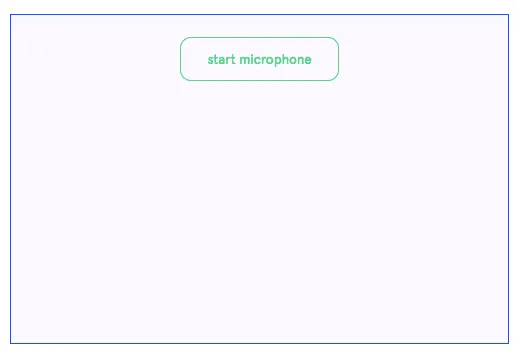

#### **By Daniel Shiffman and ml5.js collaborators, animated comic by Elizabeth Ferguson**

_Originally published at_ [_itp.nyu.edu_](https://itp.nyu.edu/adjacent/issue-3/ml5-friendly-open-source-machine-learning-library-for-the-web/) _on June 11, 2018._

Daniel Shiffman is an Associate Arts Professor at ITP. ml5.js is the product of contributions from students, research residents, faculty and alumni from the NYU ITP community, as well as a friendly cohort of other collaborators. Past and present contributors include Hannah Davis, Nikita Huggins, Hayley Hwang, Lisa Jamhoury, Darius Kazemi, Stephanie Koltun, Andrew Lee, Alejandro Matamala, Aidan Nelson, Dan Oved, Yining Shi and Cristóbal Valenzuela.

> Technology is not enough.
> Consider the technology as a tool which, in itself, could do nothing.
> Treat the technology as something that everyone on the team could learn, understand, and explore freely.
> 
> — Red Burns

Each fall at ITP, many students with a variety of backgrounds from all over the world see code for the first time in a course called “Introduction to Computational Media”. This is not a computer science course, rather it is a course about learning to think computationally and apply computation to one’s passion whether that be art, dance, biology, social justice, fashion, and more. There are no tests, nor algorithms to memorize, only creative projects to make and the sole requirement is to simply give it a try. This is a key mission of ITP — find ways to make technology and coding more accessible and inclusive, something that everyone can learn, understand, and explore freely and creatively.


The primary vehicle for the introductory course is [p5.js](https://p5js.org/), a JavaScript library from [The Processing Foundation](https://processingfoundation.org/) whose mission aligns with the course: “to empower people of all interests and backgrounds to learn how to program and make creative work with code, especially those who might not otherwise have access to these tools and resources.” Casey Reas and Ben Fry, in [A Modern Prometheus: The History of Processing](https://medium.com/@ProcessingOrg/a-modern-prometheus-59aed94abe85), write:

> The original mission of Processing was to create software that made learning to code accessible for visual people (designers, artists, architects) and to help a more technical audience work fluidly with graphics. We aspired to empower people to become software literate — to learn to read and write software. We wanted to change curriculum in universities and art schools around the world. Instead of teaching students how to use software, we thought it was just as important to teach them how to create software.

With Processing, an artist can invent her own tools rather than relying on those created and maintained by others. Today, being “software literate” is arguably more important than ever. Algorithms affect our lives in ways we couldn’t have anticipated and the explosion of so-called “deep” learning research has further extended their reach. Our interactions are now negotiated not just with each other, but with autonomous vehicles, ever-listening assistants, cameras that identify our faces and poses. Without access to and understanding of the machine learning models, underlying data, and outputs driving the software, how can we meaningfully engage, question and propose alternatives? Machine learning faces a similar challenge of approachability as simply learning to code did more than fifteen years ago. This is where [ml5.js](http://ml5js.org/) comes in: a beginner-friendly library for the web to introduce coders to machine learning, from algorithms and data to models and training.

Barriers to Machine Learning While Learning
-------------------------------------------

Beginning programmers face two main barriers with current machine learning tools. Firstly, having to install and configure a development environment and secondly, having to implement low-level mathematical operations.

Take Google’s TensorFlow, one of the most popular open-source library for machine learning. The installation instructions require setting up and configuring a python environment through a complex sequence of commands entered via a terminal interface as shown in the following image.


In the summer of 2017, deeplearn.js paved the way for making machine learning easier to access by bringing it to the web. Deeplearn.js was an [open source](https://github.com/PAIR-code/deeplearnjs) hardware-accelerated machine intelligence javascript library developed by Nikhil Thorat and Daniel Smilkov, researchers from Google’s [Big Picture Group](https://research.google.com/bigpicture/) led by Fernanda Viégas and Martin Wattenberg. Unlike the python predecessors, no environment needed to be installed and configured to use deeplearn.js. A student, artist, eductor, tinkerer, researcher could simply go to a URL and run a machine learning model in the browser. On March 30, 2018, Google announced that deeplearn.js became [TensorFlow.js](https://js.tensorflow.org/), in turn expanding the capabilities, features, and development team to support the project.

Despite the ease of running a machine learning model in the browser, beginners who want to code their own still face the challenge of mathematical notation and low-level, technical code. Machine learning frameworks are commonly geared for people with advanced knowledge of calculus, linear algebra, statistics, data science, and several years of programming in a language like python or C++. While important for research and development of new machine learning models and architectures, starting from this point can turn away newcomers with other backgrounds. Rather than thinking creatively about how to use machine learning as an artistic platform, beginners may be overwhelmed by fine distinctions between scalars, vectors, matrices, operations, inputs layers, outputs, and more.

Additionally, the TensorFlow.js examples are written using the latest features of the JavaScript language itself which might be unfamiliar to anyone in a beginner setting. Here is some example TensorFlow.js code from the “Getting Started” example:

```
// Tiny TFJS train / predict example.
async function myFirstTfjs() {
  // Create a simple model.
  const model = tf.sequential();
  model.add(tf.layers.dense({units: 1, inputShape: [1]}));

  // Prepare the model for training: Specify the loss and the optimizer.
  model.compile({
    loss: 'meanSquaredError',
    optimizer: 'sgd'
  });

  // Generate some synthetic data for training. (y = 2x - 1)
  const xs = tf.tensor2d([-1, 0, 1, 2, 3, 4], [6, 1]);
  const ys = tf.tensor2d([-3, -1, 1, 3, 5, 7], [6, 1]);

  // Train the model using the data.
  await model.fit(xs, ys, {epochs: 250});

  // Use the model to do inference on a data point the model hasn't seen.
  // Should print approximately 39.
  document.getElementById('micro_out_div').innerText +=
      model.predict(tf.tensor2d([20], [1, 1]));
}
```
This isn’t a criticism of TensorFlow.js; the documentation and examples are excellent and thorough. It’s simply for a different audience. While appropriate for an experienced data scientist with advanced JavaScript knowledge, it is not well suited for a beginning coder. In the fall of 2018 Daniel Shiffman, on behalf of ITP, received a Google Faculty Research Award to collaborate with the TensorFlow.js team and develop a higher-level library to address this gap.

In the meantime, Cristobal Valenzuela (ITP ’18) had already created a github repository called “[p5deeplearn: deeplearn.js meets p5](https://github.com/cvalenzuela/p5deeplearn)”. This repository was the genesis of ml5.js, with the “5” paying homage to p5.js and the Processing philosophy itself. At ITP we organized a weekly working group to discuss developing the library itself and invited guest artists and researchers to participate in its development. The guests and collaborators included Jabril Ashe, Kate Compton, Hannah Davis, Darius Kazemi, Gene Kogan, Kyle McDonald, and Yining Shi.


### Walking Through The Machine Learning Door

In an introductory programming course, is it possible to include a one-week module on machine learning? What tool could be used? The TensorFlow.js team opened the door to machine learning at a single URL with the increasingly ubiquitous programming language of the web: JavaScript. With ml5.js, we invite beginners to walk through the door. Built on top of TensorFlow.js with no other external dependencies, the library provides access to machine learning algorithms and models in the browser with examples that use beginner-friendly JavaScript. By introducing beginners to machine learning, we hope to inspire creative experimentation and provoke discussions about data, training, and algorithmic bias and ethics.

So, how does this happen? What is the first example to introduce the topic of machine learning to a beginner? Let’s consider the common task of image classification. ml5.js (via TensorFlow.js) provides an interface for loading a “pre-trained” model from the cloud with one line of code.

```let classifier = new ml5.ImageClassifier('MobileNet');```

This model, known as “[MobileNet](https://arxiv.org/abs/1704.04861)” was trained on [ImageNet](http://www.image-net.org/), a database of approximately 15 million images labeled with 1,000 different classifications. What the model classifies a given image is entirely dependent on that training data — what is included, excluded, and how those images are labeled (or mislabeled).

As demonstrated on ml5js.org, the model and ImageClassifier object can be used to classify an image.


[TRY THIS EXAMPLE HERE](https://ml5js.github.io/ml5-homepage-demo/)

In addition, the classifier can label frames of recorded or live video when linked with a p5 video element.

```
let video = createCapture(VIDEO);
let classifier = ml5.imageClassifier('MobileNet', video);
```

Once this happens, things get slightly more complicated as the concept of a callback must be employed when the classifier is finished analyzing the image and ready to return results.

```
classifier.predict(gotResult);

function gotResult(results) {
  console.log(results);
}
```

The above code logs a list of classifications for the current video image — along with a “confidence” score” — to the browser console. A version of this code that displays the webcam image and results is running below (you’ll have to click “allow webcam” to see the results).

What does the model think you are? An oxygen mask? A bow-tie? A bassoon? Sunglasses?


[TRY THIS EXAMPLE HERE](https://ml5js.github.io/ml5-adjacent/02_ImageClassification_Video/)

The failure of the model to recognize a person is considered a success for ml5.js. It sparks the discussion. Why is not it not able to label me as a “person”?

Try holding up an object in front of the camera, like your cellphone or a coffee mug.


Suddenly it works perfectly. Machine learning is not magic. The model only knows about what it’s been trained with. In this case, the _MobileNet_ model was trained on a somewhat arbitrary set of objects. It’s surprisingly good at recognizing obscure dog breeds and bird species, yet has no understanding of a “face” or “person.”


It’s our hope that by exposing a model’s flaws and having it easily accessible in ml5.js, creative coders around the world will be inspired to make their own creative experiments while simultaneously recognizing the strengths and weaknesses of any model. Pre-trained models like _MobileNet_ provide friendly starting points for beginners. With just a line or two of code, a variety of models can be run. Below are a few interactive demonstrations of other models available with ml5.js.

**LSTM Text Generation**: This example generates text in the style of an author via a pre-trained model ported to ml5.js by Cris Valenzuela. The model here is trained on [public domain works](http://www.gutenberg.org/ebooks/author/6368) by Zora Neale Hurston.


**Style Transfer**: This examples takes the style of one image and applies it to the content of another. The model was ported to ml5.js by ITP alumna and guest artist Yining Shi and requires a pre-trained model for a particular style. Here the model was trained on [The Great Wave off Kanagawa, 1829 — Katsushika Hokusai](https://en.wikipedia.org/wiki/The_Great_Wave_off_Kanagawa).


**Pitch Detection**: This example uses a pre-trained model known as “CREPE”, ported to ml5.js by Hannah Davis, and was trained on several existing audio datasets [described in this paper](https://arxiv.org/abs/1802.06182).



**Word2Vec**: Word2Vec is a model that associates a given word with a list of numbers. This allows mathematical operations to be performed on text. The numbers are generated by looking at how the words appear in relationship to other words in a corpus of text. The word vectors below are from a [Google open source model trained on news articles](https://code.google.com/archive/p/word2vec/).


**PoseNet**: PoseNet, ported to ml5.js by current ITP student Dan Oved, is a model that performs “pose estimation”, a computer vision technique to determine the pixel location of key points on a human body in an image. The pre-trained model was created using the [Cambridge Landmarks](http://mi.eng.cam.ac.uk/projects/relocalisation/) and [7-Scenes Dataset](https://www.microsoft.com/en-us/research/project/rgb-d-dataset-7-scenes/).


In documenting the above examples, our priority is to be clear and transparent with where the model is sourced from, what data was used to train the model, and what data might be missing.

Creative Datasets and Responsible Data Practices
------------------------------------------------

The preceding examples highlight the core features and goals of ml5.js version 0.1.0, the very first beta. But there’s much more to come. Beyond an educational and creative resource for experimenting with pre-trained models, the library also aims to introduce students and creative coders to the entire machine learning process: from collecting data, cleaning data, training a model, testing a model, and deploying. How can we make this full narrative available and accessible to beginners?

Two aspects of the project hint at what is to come: easily accessible sample datasets within the library plus functions to help segment data and process batches to train a model. This work has largely been driven by Hannah Davis (ITP ’13) who spent the semester in residence working on ml5.js and related machine learning research focused on datasets.

It’s easy to forget all the work that goes into processing data before actually using the data itself. When first introducing machine learning, sample datasets can act as a starting point for beginners to explore key concepts. At our first ml5 meetup, Hannah presented the [toy datasets](http://scikit-learn.org/stable/datasets/index.html) included in scikit-learn, a machine learning library for Python.


Hannah asked: what if ml5.js also included sample datasets that people could access with a call to a JavaScript function? In addition, clear documentation — further inspired by scikit-learn’s “describe” function — could describe the dataset including its origins, how it was collected, and what it contains.

Literacy around datasets also includes how it is used within models. Distinctions within datasets such as training, testing, validation and unknown data can be particularly confusing for beginners to machine learning. Incorporating features of the library to help segment data and process it in different batches would introduce people to the process. While this is not part of the first release for ml5.js, it is something we hope to incorporate next.

Lastly, what data we choose to provide is just as important as how we provide it. A core principle of ml5 is to feature non-traditional kinds of data. The classic [IRIS flower data set](https://archive.ics.uci.edu/ml/datasets/iris) for classification has found its place in countless data science examples and the even more ubiquitous [MNIST database of labeled handwritten digits](http://yann.lecun.com/exdb/mnist/) is found in almost every introductory machine learning image classification tutorial. Non-traditional datasets can encourage people to think creatively about data and how they might use their own data in a project. One way to do this is to pick sample datasets from creative art spaces. The database of “doodles” from Google’s quickdraw dataset can act as a fun, playful variation on MNIST.


Hannah’s [first sample dataset](https://github.com/ml5js/ml5-data-and-training/tree/master/datasets/landscapes) contributed to the library is a set of just under 4,000 landscape images. Like one might expect, the landscapes are labeled in a traditional way with seven categories: “field, mountain, city, lake, forest, ocean, road.” However, Hannah also conducted an experiment by using a crowdsourcing website to have people label the images with a more subjective “emotional” quality, with the eventual goal being to train a model to detect emotion in images. In [her blog post about the dataset](https://itp.nyu.edu/AI/creating-datasets/), Hannah writes:

> This second usage is an experiment on my part to explore something I’ve been calling ‘subjective datasets,’ or datasets where the labels are wildly more subjective than something like ‘cat’ or ‘dog.’ This overlaps quite a bit with sentiment analysis, and is my first attempt at creating an emotional dataset.

In addition to the dataset and walkthrough of how it was created, Hannah published a “[Making Your Own Datasets](https://ml5js.org/docs/data-preparing-your-own-data)” tutorial for the ml5 website, answering questions such as “Where does data come from?” and “Where do labels come from?” as well as emphasizing “Responsible Data Collection”.

> It is important, when collecting data, to think critically at every stage along the collection process. Some questions to ask yourself include: Whose data is this? Would they want you to scrape this? Is it public? Is there a way to ask permission and/or pay for the data? Can you collect data with appropriate licensing?
> 
> You want to be careful of under-representation bias in data collection (also known as sampling bias. For example, if you’re collecting a dataset of the best movies of all time, are you asking only those in your immediate circle? For situations where there are obvious gaps in your data, it’s important to see if there’s a way to collect more, from varied sources.
> 
> The converse of this is collecting too much data. Is it really necessary to your project to ask for gender and age? Could collecting religion, ethnicity, or nationality be dangerous now or down the road? Are you collecting only what is absolutely necessary? Is there something that would be better to leave out?

Hannah’s work inspired us to think about what is missing from the pre-trained models we provide. For beginners who feel intimidated by machine learning or that they do not belong, it’s important for everyone to see themselves in the data. During our first round of ml5.js development, we trained the text generator example described above with three authors: Shakespeare, Hemingway, and Nietzsche. These authors all have something in common: they are deceased white men. Recognizing this, we searched through [Project Gutenberg](http://www.gutenberg.org/), a database of public domain texts, and pulled a more inclusive selection of authors that includes women and people of color. Our pre-trained model list is now: Roberto Bolaño, Charles Darwin, W. E. B. Du Bois, Ernest Hemingway, William Shakespeare, Mary Shelley, Zora Neale Hurston, and Virginia Woolf.

Building on Pre-Trained Models
------------------------------

Another effective technique for working with custom datasets is referred to as “transfer learning.” In this case, instead of training a machine learning model from scratch with a dataset, a pre-trained model is used as the starting point for training with new data. Working with the TensorFlow.js team, researchers and artists from Google Creative Lab developed a project called “[Teachable Machines](https://g.co/teachablemachine)” that demonstrates this process. With a webcam, someone can interactively and in real-time train a machine learning model to classify input from a video camera.

Nicole He from Google Creative Lab demonstrates Teachable Machine: an experiment that makes it easier for anyone to explore machine learning, live in the browser — no coding required.


_Nicole He from Google Creative Lab demonstrates Teachable Machine: an experiment that makes it easier for anyone to explore machine learning, live in the browser — no coding required._

In addition to the Teachable Machine website itself, Google released “[teachable machine boilerplate](https://github.com/googlecreativelab/teachable-machine-boilerplate)”: the bare minimum amount of JavaScript code needed to create your own version. This inspired us to think about an ml5.js version of transfer learning. How do we make the process simple but expose its details to reduce the feeling of “magic”? For this end, we incorporated a “FeatureExtractor.”

```
let features = ml5.featureExtractor('MobileNet');
```

As discussed earlier, _MobileNet_ was designed to assign a label to an image: “coffee mug”, “turtle”, etc. However, behind the scenes, before it actually does so, the _MobileNet_ model runs a mathematical process called a “convolution” (similar to what happens in a photoshop filter) which transforms all the pixels into a reduced set of numbers. A 200×200 image with 40,000 pixels results in a list of 135 floating point numbers. These numbers are considered the “features” of the image. While _MobileNet_ might associate of a certain set of features with a “coffee mug” the transfer learning process allows us to assign new labels to the features extracted from new images.

Once we have the extractor, the next step is to create a classifier from it:

```
const classifier = features.classification();
```

We can tell the classifier about images with our own labels.

```
classifier.addImage(puffinImage1, 'Puffin');classifier.addImage(puffinImage1, 'Puffin');
classifier.addImage(puffinImage2, 'Puffin');classifier.addImage(puffinImage2, 'Puffin');
classifier.addImage(puffinImage3, 'Puffin');classifier.addImage(puffinImage3, 'Puffin');
classifier.addImage(snowLeopardImage1, ‘Snow Leopard’);classifier.addImage(snowLeopardImage1, ‘Snow Leopard’);
classifier.addImage(snowLeopardImage2, ‘Snow Leopard’);classifier.addImage(snowLeopardImage2, ‘Snow Leopard’);
```

Finally we can train a new model based on the features on the images we added.

```classifier.train();```

And classify a new unknown image.

```
classifier.classify(someImage, gotResult);

function gotResult(labels) {
  console.log(label);
}
```
A use case of this is to train an interactive system to recognize custom images. Alejandro Matamala created one of the first projects at ITP with this approach in “PongML”. In his project, someone trains a machine learning model in realtime to recognize and then play the game according to person’s specific poses.


What’s Next?
------------

The first commit to the ml5 library itself was on Oct 4, 2017. A little over eight months later, thanks to the support from Google, we are thrilled to release this first “beta” (version 0.1.0) of ml5.js.


While there have been a few workshops taught with ml5 at [ITP](http://itp.nyu.edu/), [The School for Poetic Computation](http://sfpc.io/), and [Eyebeam](https://www.eyebeam.org/) already, the real work begins now as artists, educators, and beginning coders use the library in education and practice. What is not clear? What is missing from the documentation? Where do things seem too much like magic? Too complicated? The best way to develop a library for beginners is to work with the library with beginners.


We hope this release is just the beginning; more tutorials, examples, and models are coming over the summer. One that we are particularly excited about for its creative possibilities is image to image translation (known as pix2pix) that Yining Shi is [in the process of porting](https://yining1023.github.io/pix2pix_tensorflowjs/) to ml5.js. Yining will also be teaching the first workshop with ml5.js beta at ITP camp! In the fall, Gene Kogan and Mimi Onuoha will be in residence at ITP to continue to help us think through the API choices and ethical questions surrounding the development of the library and associated datasets and documentation.


And yes, that ITP course “Introduction to Computational Media” for beginners learning to code for the very first time will include a new one week module in the fall semester: _machine learning_. Join our [Slack channel](http://ml5js.slack.com/), follow us on [Twitter](https://twitter.com/ml5js?lang=en), and contribute to the [Github repository](https://github.com/ml5js) to participate in the discussion!
