_Originally published at on Medium in on May 16, 2019._

Written by [Itay Niv](http://www.itayniv.com/). Edited by [Ashley Jane Lewis](https://ashleyjanelewis.wordpress.com/).

**The Heart of Reading Together**
---------------------------------

In a society full of screens as potential social inhibitors, the work of ITP student [Itay Niv](https://twitter.com/Itay_niv) has been a whimsical breathe of fresh air, blowing the cobwebs off of a timeless idea — **tech that brings loved ones together.** His thesis project, _Let’s Read a Story_, emerged in the third semester of his masters degree and the third trimester of his wife’s pregnancy as a concept that would open up new modes of storytelling with his future child. This colorful responsive app uses machine learning to adapt classic fables into a fun interactive reading activity.

It comes as no surprise that the experience of using this project is just as contemplative and considered as the creator himself. _Let’s Read a Story_ is the beautiful outcome of what happens when you build from the heart, working towards something special for the ones that you love. This agile system will help parents and kids cuddle up, sprinkling creativity into the quiet book nooks, the bedtime stories, the read-on-go moments and everything in between.

As an undergrad, Itay studied graphic design while working as a motion vfx artist and exploring interactivity and physical computing. Before coming to ITP, he worked for several years as a UX and UI designer. In this masters degree he learned how to code robustly and endeavoured into machine learning for the first time shortly before building _Let’s Read a Story_. Itay’s work is impressive as a stand alone piece but also a motivator to those who have a big idea before they have the skills to execute it.

It has been a pleasure to help document and share this wonderful thesis project with our community. Follow Itay Niv directly to see where _Let’s Read a Story_ goes next! You can find [his website here](http://www.itayniv.com/) and [follow him on Twitter here.](https://twitter.com/Itay_niv)

> — [Ashley Jane Lewis](https://twitter.com/ashleyjanelewis), 1st year ITP student and ml5 Community Manager Research Assistant

_Let’s Read A Story_ is a speculative exploration on how computers and technology can turn story time into a conversation between parents, children and a computer. The project takes the corpus of Aesop fables and investigates the possibility of exploring the connections between different characters and ideas from the original fables in a new and fun way using recently available machine learning language models.

You can find a working demo [here](https://www.letsreadastory.xyz/) (best performance on chrome desktop).

In the following post I will try to describe the thought process and some of the technical aspects I encountered while designing and building the project.

👶 **Some Background**
----------------------

_Let’s Read A Story_ was created as my thesis project at ITP (NYU’s Interactive Telecommunications program). At ITP, a program devoted to exploring creative uses of technology and the recently possible. The 4th semester in the program is usually dedicated to developing a thesis project. Just a few months before it was time for me to start my second year at ITP my partner and I discovered the exciting news that we were expecting our first child.

So when the moment came to think about what I wanted to work on for the thesis project, the arrival of my child was a great inspiration on my thought process. I understood quite fast that I wanted to build something with technology that would allow me to connect with him. As my partner and I started to read texts about child development and parenthood, I came across this quote by the poet Friedrich Schiller:

> “Deeper meaning resides in the fairy tales told to me in my childhood than in the truth that is taught by life.”

Reading this quote reminded me of my childhood and the memories of children books my parents and brothers had read to me, before there were any screens in our lives. The simple pleasure of browsing through pages of a children’s book, the smells and textures, the colors and sounds that lived once when we were kids. No different than other children, as a child, books and movies were my entire world. From them I learned what friendship meant, the values of family, love and at a later stage it is from animated movies which from I learned english.

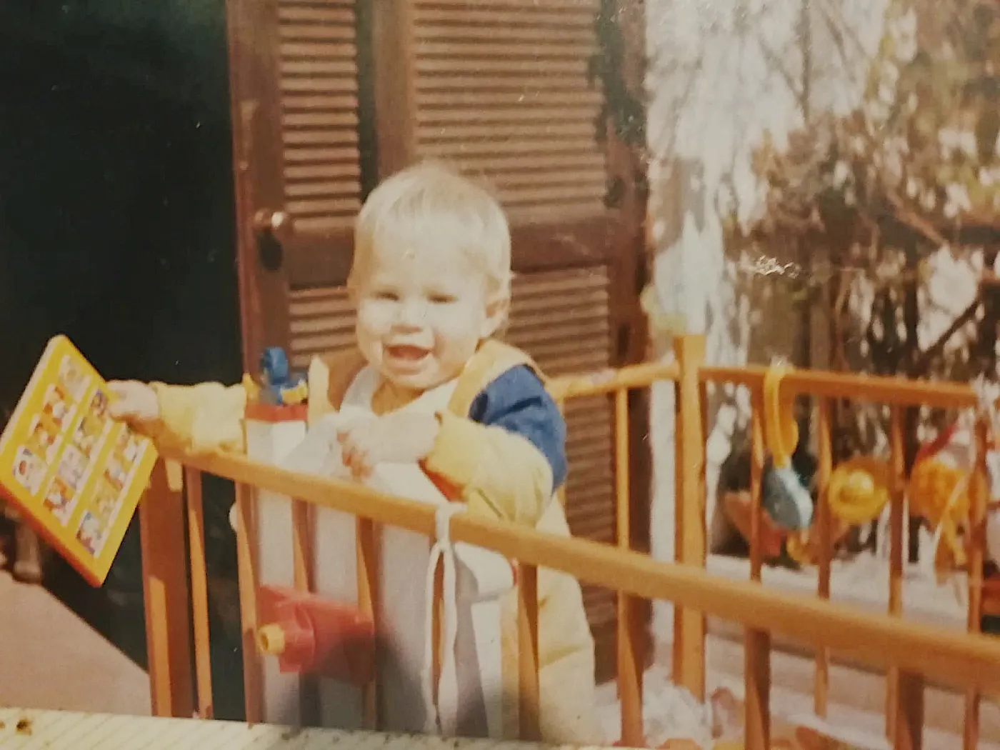

So I got to think of what has changed in the last 30 years since I was a child? How will my child explore the stories, sounds and textures of fairy tales and other children’s narratives?

In recent years there has been a rise in popularity of smart devices and speakers using advanced NLP technologies. Next year, on average, each American household will have a smart device like Apple Homepod, amazon Alexa or Google Home. With applications Intended for preschoolers available on various of these popular platforms, children are talking to technology and technology is starting to talk back.

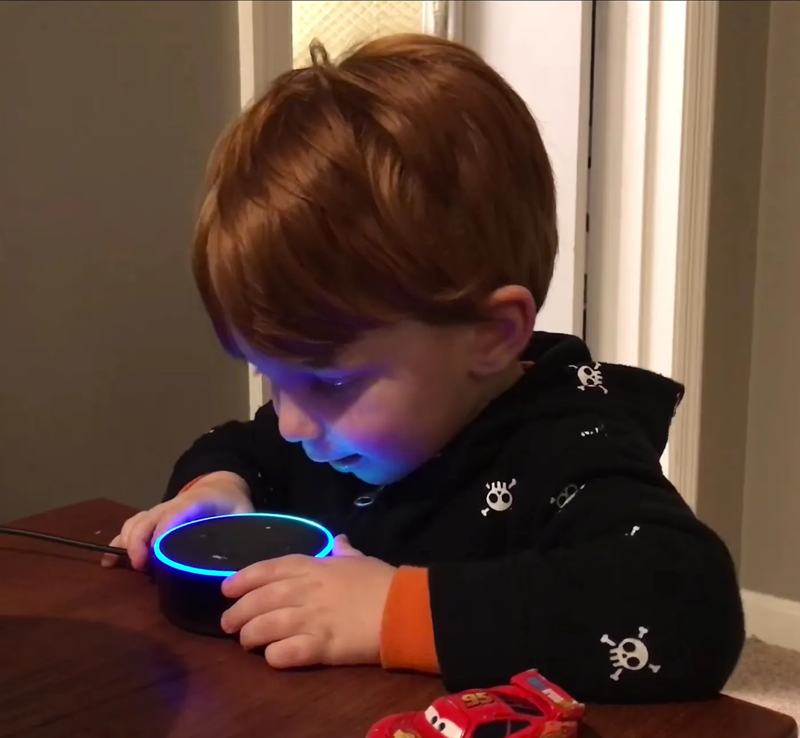

**Does that mean we can start talking to books? This question echoed in my mind for days and was the main drive in the research of this idea for my thesis project.**
---------------------------------------------------------------------------------------------------------------------------------------------------------------------

🏗️ **The Narrative Structure**
-------------------------------

For over more than 27,000 years, since the first cave paintings were discovered, telling stories has been one of our most fundamental communication methods. Aristotle, who analyzed the dramatic structure in his poetics in 335 BCE determined that a whole is what has a beginning and middle and end. In the 19th century, it was Gustav Freytag that coined the narrative pyramid — the dramatic structure is divided into five parts; exposition, rising action, falling action, climax and dénouement → the story’s catharsis.

Press enter or click to view image in full size

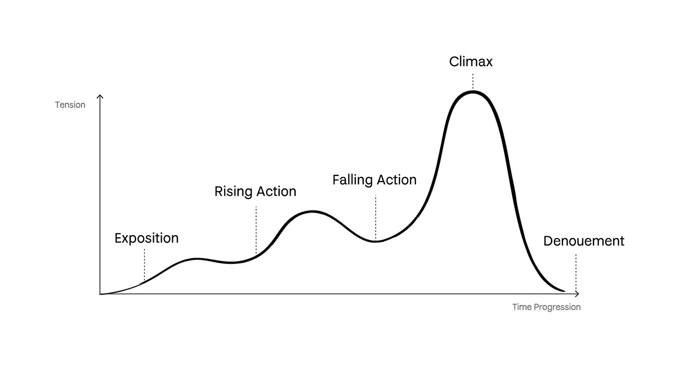

For children, a story is an interactive experience — as a story progresses and develops, children ask questions. This is a great learning activity, kids learn to associate images in the book with the story and this develops their visualization capacity and imagination. They learn how to read and think.

For me, a good children’s book is much more than just text. It’s an immersive experience that includes(but is not limited to) textures, illustrations and music that accompanies it. One of my favorite books growing up was peter and the wolf by Sergei Prokofiev — that book had an orchestral soundtrack, a symphony — each character in the book had its own theme music played by a different instrument. The illustrations were amazing too!

Peter and the Wolf, Sergei Prokofiev — unknown publication

For my son, as we move away from printed matter into digital storytelling for children, my hopes are that we would seize the opportunity inherent in new technologies to somehow, not only preserve but enhance these unique experiences.

Peter and the Wolf, Sergei Prokofiev

📚 **Finding a Suitable Dataset**
---------------------------------

I knew that I wanted to work with existed text from children’s books to create this experience, and I wanted the project to facilitate a conversation and imaginative thinking, to incorporate various components like illustrations and sound, characters etc, and for it to be as accessible as possible to children and parents.

Since the main part of this project is the text generation, it was clear to me that the avenues which I wanted to research and explore were first and foremost language models, and I had to choose a dataset to analyze.

After experimenting with a few canonic corpuses, I chose to focus and analyze Aesop Fables. I was drawn to the Aesop Fables text because of its concise, yet rich story lines, the use of animal archetypes as metaphors, and the strong morals embedded in each story.

Each original Aesop Fable contains:

1.  A short title, usually very descriptive of the story’s content and characters.
2.  The story itself, usually no more than 30 sentences.
3.  The moral of the story, usually contains a metaphor built on the inherent nature or trait of the animals in the story.

⚙️ **Analyzing the Data**
-------------------------

After research with various machine learning models, such as [LSTM’s](https://ml5js.org/docs/training-lstm), I came across the idea of word vectors. Word vectors belong to a group of machine learning models, or neural networks that are trained to reconstruct linguistic contexts of words and produce word embeddings. In natural language processing tasks, an essential part of the research and what requires effortful work is to convert text data into vectors. In that manner, it’s easier for a computer to then process and analyze the text. Once the text is embedded into a vector, one can easily determine whether two points are similar or not by calculating their euclidean distance. Techniques like [word2vec](https://ml5js.org/docs/word2vec-example) do just that by converting a word into a vector — thus the corresponding vector of the word ‘burger’ will be closer to the word ‘sandwich’ than ‘salad’ or ‘dessert’. A simple example for [word2vec is available within the ml5 library](https://ml5js.org/docs/word2vec-example).

While embedding a sentence or a paragraph, along with words the context of the whole sentence needs to be captured in that vector, this makes the embedding process a little more tricky. This is where the [Universal Sentence Encoder](https://arxiv.org/abs/1803.11175) comes into the picture. The [publicly available pre-trained model](https://github.com/tensorflow/tfjs-models/tree/master/universal-sentence-encoder) enables users to encode corpuses of text (sentences as well as whole paragraphs!) into high dimensional vectors that can be used for text classification, semantic similarity, clustering, and other natural language tasks.

For [_Let’s Read A Story_](http://www.letsreadastory.xyz/) I used the [publicly available tensorflow.js model](https://github.com/tensorflow/tfjs-models/tree/master/universal-sentence-encoder) of universal Sentence Encoder and implemented it to work on a node application. After compiling a JSON file that holds all the stories broken down to individual sentences, their titles, characters, and animals.

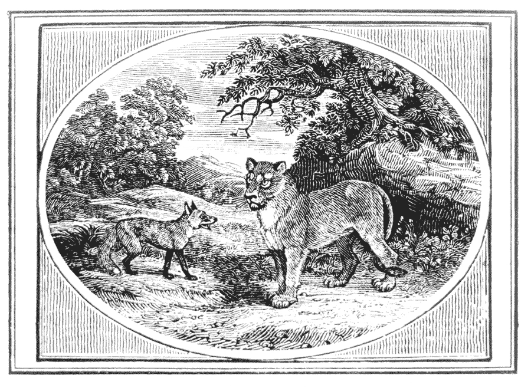

The node application analyzed all sentences derived from the fables (~1500 sentences) and created another file that holds all the embeddings. This yields an ‘embedding map’ containing sentence embeddings for each sentence in a high dimensional space, we can then visualize it in 2 dimensions like this:

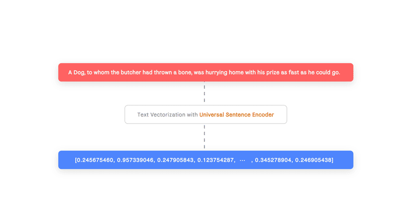

[A live version of the map is available here](https://projector.tensorflow.org/?config=https%3A%2F%2Fgist.githubusercontent.com%2Fitayniv%2F83a0b4dbe9b13d64871809e31c823491%2Fraw%2F7dce0ce727782a45431bffe0178a10efef6edce8%2Fjson-file)

In this interactive map we can see that similar semantic meaning sentences are clustered next to each other.

💡 **First Results**
--------------------

The first time I generated a new narrative out of the map I wrote a simple node application that picks a random sentence from the analyzed Aesop fables corpus and gives back the 10 closest sentences in the vector space. I used ml5’s [word2vec class](https://ml5js.org/docs/Word2vec) that uses cosine similarity to measure distance between the different sentences and modified it a bit so the class could work with my data structure[(you can find the modified class here)](https://github.com/itayniv/lets-read-a-story/blob/master/sentence2vec.js):

This was the result I got:

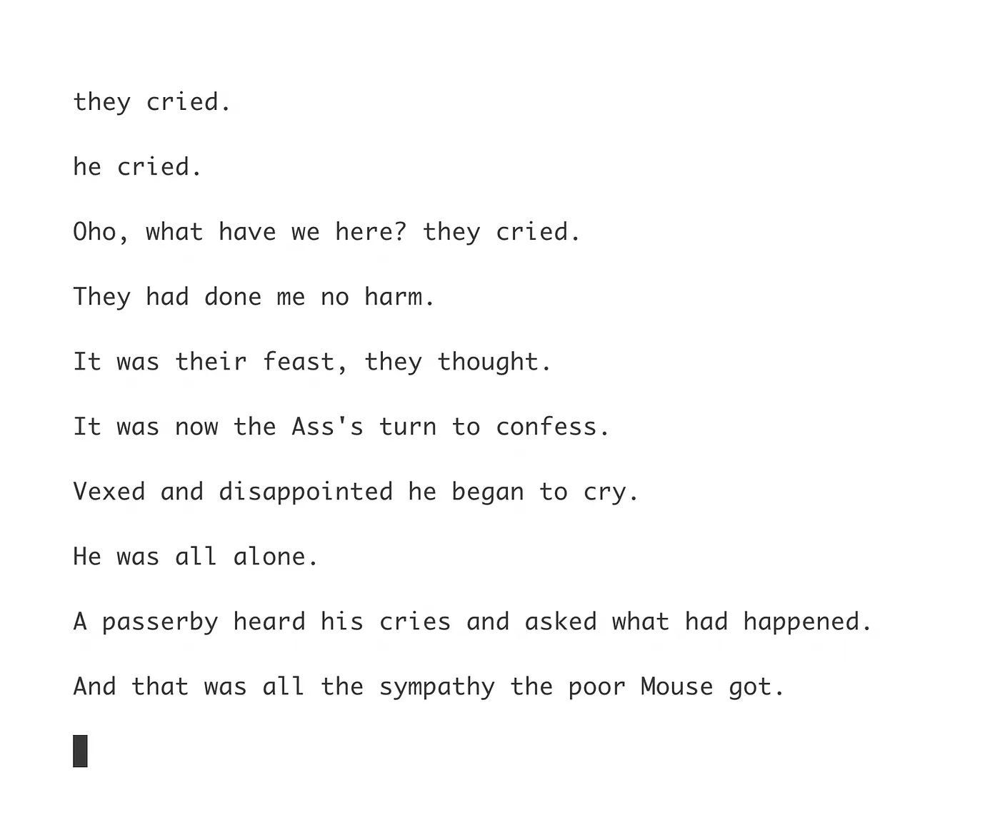

This was exciting to me as this was a new piece of content that made sense and had some sort of narrative structure to it.

I continued experimenting with this technique. After talking to Allison Parrish about this technique, an idea popped up to try and generate content based on an original story’s progression. To do this I started exploring different ways in which I can visualize Aesop fables on the embeddings map. [Using tensorflow.js projector tool](https://projector.tensorflow.org/?config=https%3A%2F%2Fgist.githubusercontent.com%2Fitayniv%2F83a0b4dbe9b13d64871809e31c823491%2Fraw%2Ffd8541095fba71fa3b8ee439bcdf55b5172b61d1%2Fjson-file), If we visualize the story “The Swallow and the Crow” on the map, this is how it looks like this:

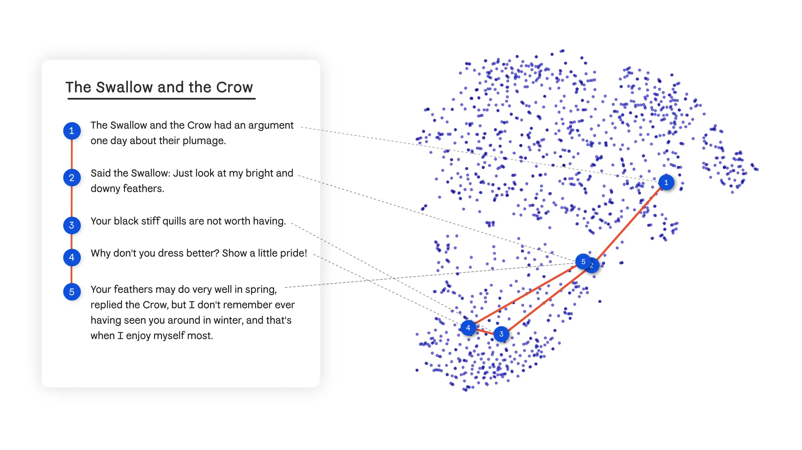

“The Swallow and the Crow” → red line signifies story progression

If we can visualize a story and see its progression through vector space, what if we replace the the original sentences with the nearest semantic neighbor of each sentence in the story; this might give us a version of that story while keeping the story’s structure.

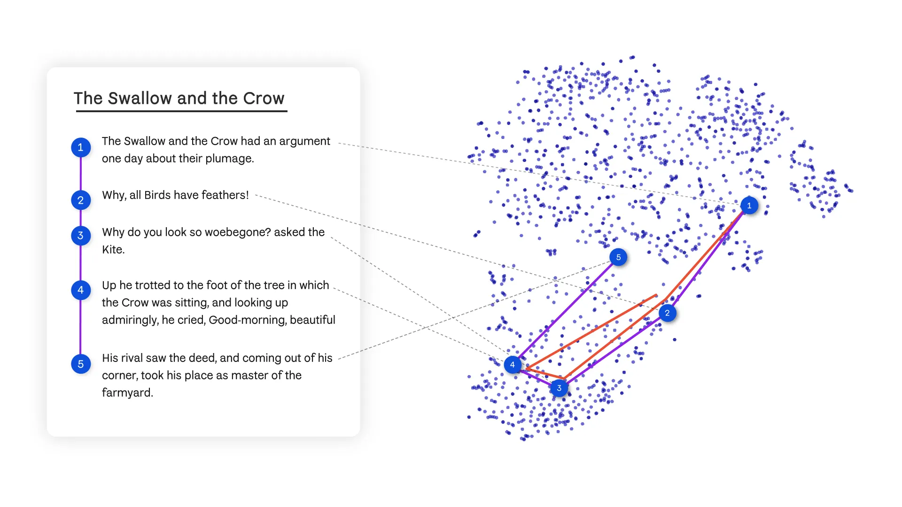

Variation on “The Swallow and the Crow” → purple line signifies similar story progression

**\*\*\* Hypothetically, if we use a larger dataset of sentences, or augment the current one, the output would appear less nonsensical.**

🛠️ **Building the Application**
--------------------------------

As I started the work on this project I knew I wanted it to live on various devices, surfaces and spaces, to be as accessible as possible to whoever wanted to explore. But for the first version, I thought it would be best if I just prototype for web browsers, that way it will be accessible to almost everybody. The prototype used Node.JS for the server side (vector analyzing, sentiment analysis and serving the content) and html, css and javascript, for the frontend functionality (everything else).

Based on the concept of retrieving similar stories I began building the application which the main focus was to try and simulate a conversation. As speech is the most natural user interface for kids and allows minimum friction between action and result, I decided to utilize the web speech api. Readers can input content using their voice.

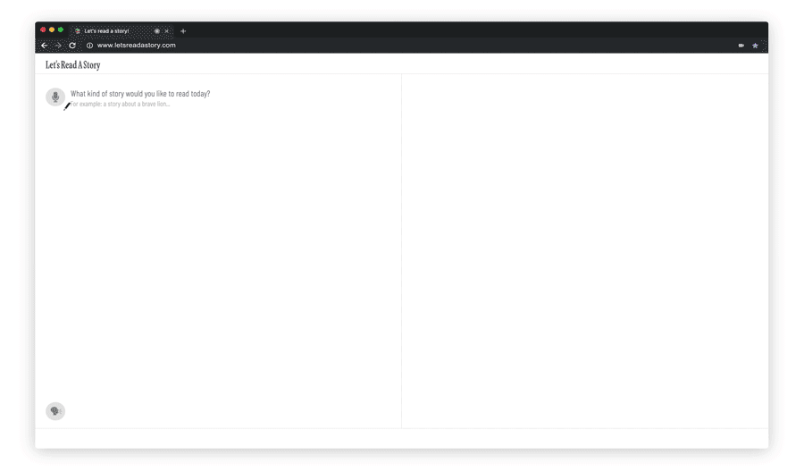

Using [ml5's Word2Vec](https://ml5js.org/docs/Word2vec) modified Sentence2Vec class ([see code snippet here](https://gist.github.com/itayniv/1ed4e3eeefa2a6a7b33f0889b53fed1f)) the script iterates through all the sentences embedded beforehand by the Universal Sentence Encoder, i.e the ‘embedding map’. This gives back the sentence which is most similar in its semantic meaning to the reader input. Once I obtain the most similar sentence from the dataset i serve it to the reader as the first line of the new story. Also, the story algorithm takes the similar sentence and finds out the origin story of that sentence. The story algorithm generates a similar story based on that original story, derived from the reader’s prompt, and that is the seed structure that each story begins with.

As the story unfolds itself, readers can intervene and change the direction of the story by inputting their idea on how the story should continue. The story algorithm knows to fetch relevant content based on similar plot lines form the dataset. Every time the reader inputs text the story the algorithm pivots the narrative arc and matches a new narrative arc based on the new readers input.

To enrich the stories, I chose to use a recurrent neural network trained on the quick, [draw! dataset](https://quickdraw.withgoogle.com/data). The story algorithm knows how to identify different elements in the text and using the [ml5 library](https://ml5js.org/docs/sketchrnn-example) and p5.js, draws them to the page as the sentence is being added.

There is a simple RegEx search on the resulting sentences. The story algorithm functionality determines which animal, character or object appears in the generated story and then reconstructs an illustration from the trained sketch RNN model using p5.js. If the sentence contains an animal that **does not** exist in the model, there is another functionality that ‘enriches’ the model’s keywords and matches similar animals, objects and character specified in the story, for example a dog class will generate foxes and wolves.

Using [AFINN-based sentiment analysis library](https://www.npmjs.com/package/sentiment) the story algorithm analyzes each sentence to determine whether it has a positive or negative sentiment. Positive sentiments get a major scale melody and negative sentiments get a minor scale accordingly. Each animal gets a different musical instrument as well, according on its characteristics.

After user testing the application on dozens of children, I noticed the growing desire for kids to engage with the screen and story medium. As a solution to this I turned the entire screen space into a drawing canvas — in this manner, a child can add drawings to the story and be even more engaged.

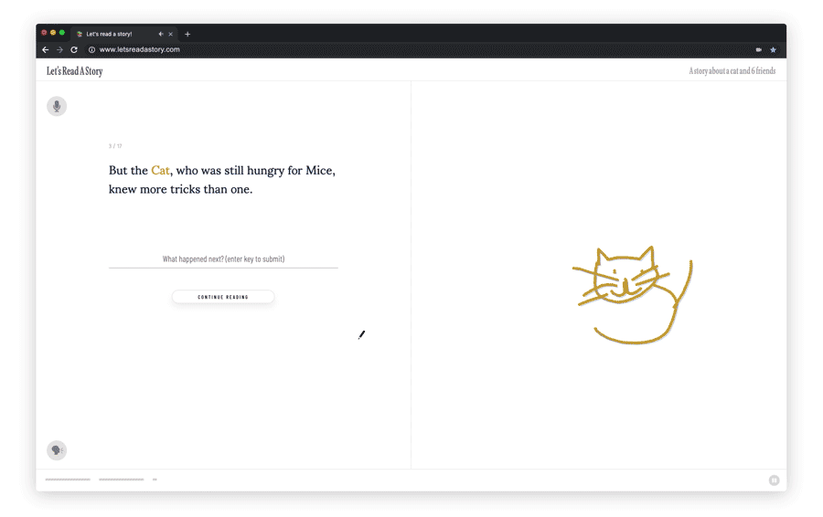

In the end of each generated story, the story algorithm embeds the new generated story using _Universal Sentence Encoder._ By preprocessing all the stories through the _Universal Sentence Encoder_ and compiling a vector embedding for each fable, the story algorithm is able to fetch a moral from the dataset that best fits, based on the semantic similarity to original stories.

👨‍👩‍👦‍👦 **User Testing**
----------------------------

A key part of that process was user testing. I user the project with kids in different age groups, from 3yr olds to 11yr olds, and iterated on their feedback and behaviour I documented.

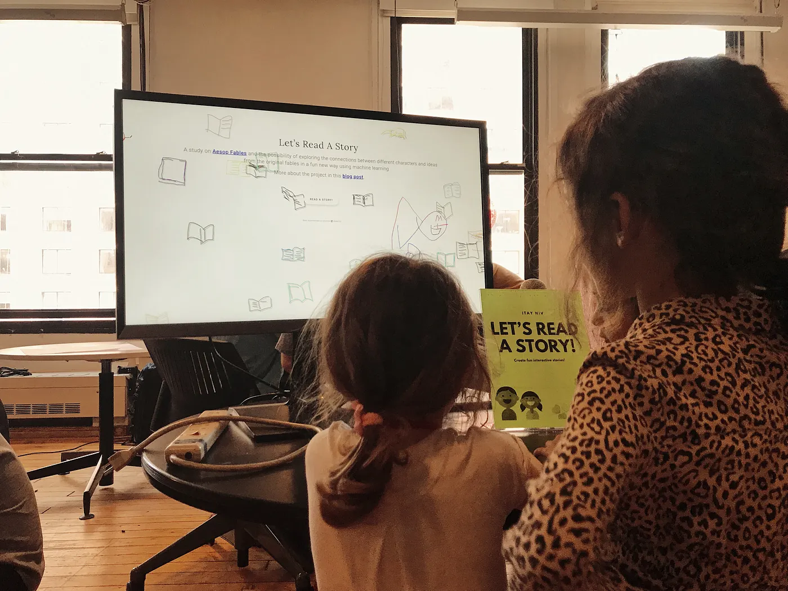

Through testing with children I learned that my early assumptions about content creation and interaction had to change with different stages of the development.

A strong example to this was the reaction I saw from kids before and after enabling drawing capabilities in the experience. I hope to iterate on this in the next versions. I believe drawing could be a great force for creation, connecting kids drawings as input to the experience would be an extremely interesting experiment.

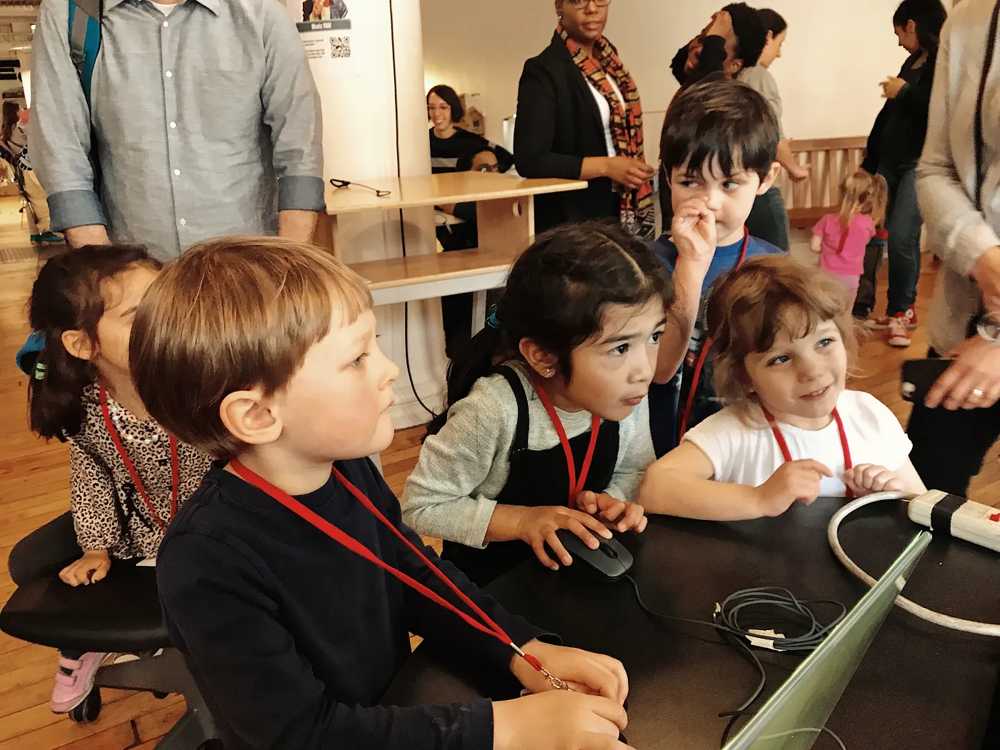

🏁 **Final Thoughts**
---------------------

During the creation process of _Let’s Read a Story_, I constantly found myself thinking about the ethics of this experiment. By generating content with an algorithm, am I contributing to replacing traditions and professions so precious as authors, illustrators and musicians? That ironic thought disturbed me, as this was the exact opposite of the objective I had in mind. My experiment was meant to create a contemporary engagement with storytelling, not to replace it — to find ways these different mediums can be remixed and explored in new, exciting ways.

As I tested and documented _Let’s Read A Story_ I noticed something magical in the interaction between the child and the parent, something that transforms ordinary story time into a creative adventure. My son, Carmi, is 3 months now, and I can’t help but anticipate using it with him.

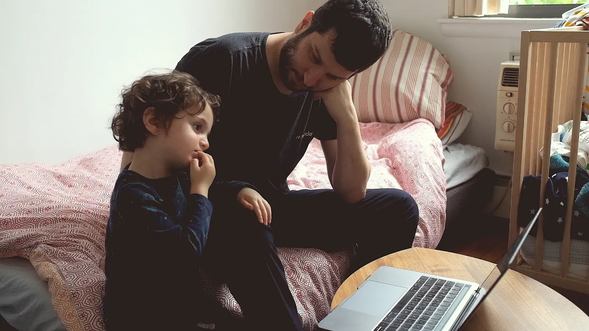

This is not the end of my experiment and there’s much more to learn and explore. But I did reach one firm conclusion that i’ll take with me through the next parts of the project; There is a human soul at the core of every story, that’s irreplaceable. And I must always remember to create tools that would help people tell their story.