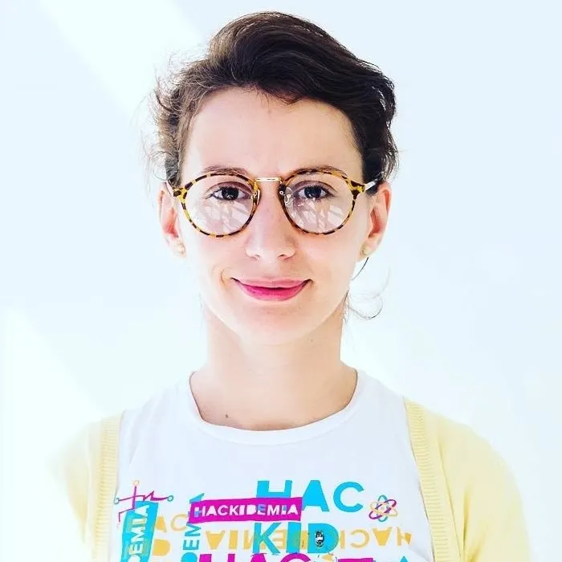
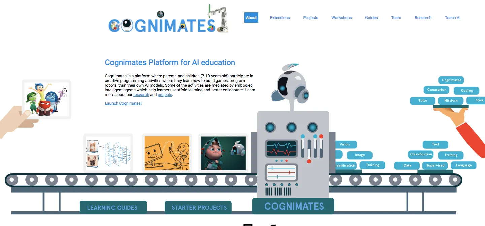
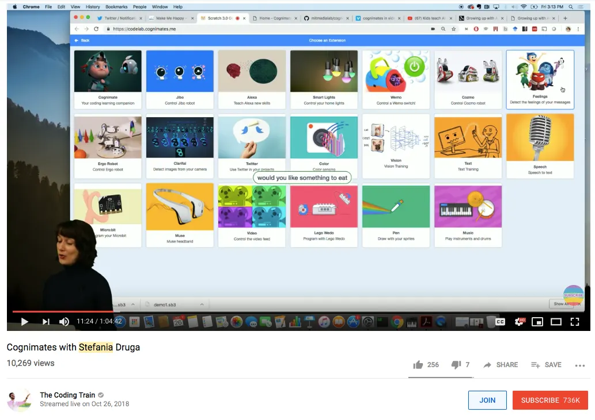
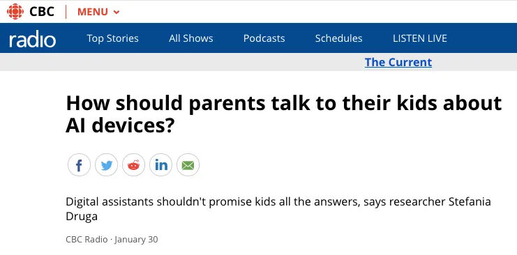
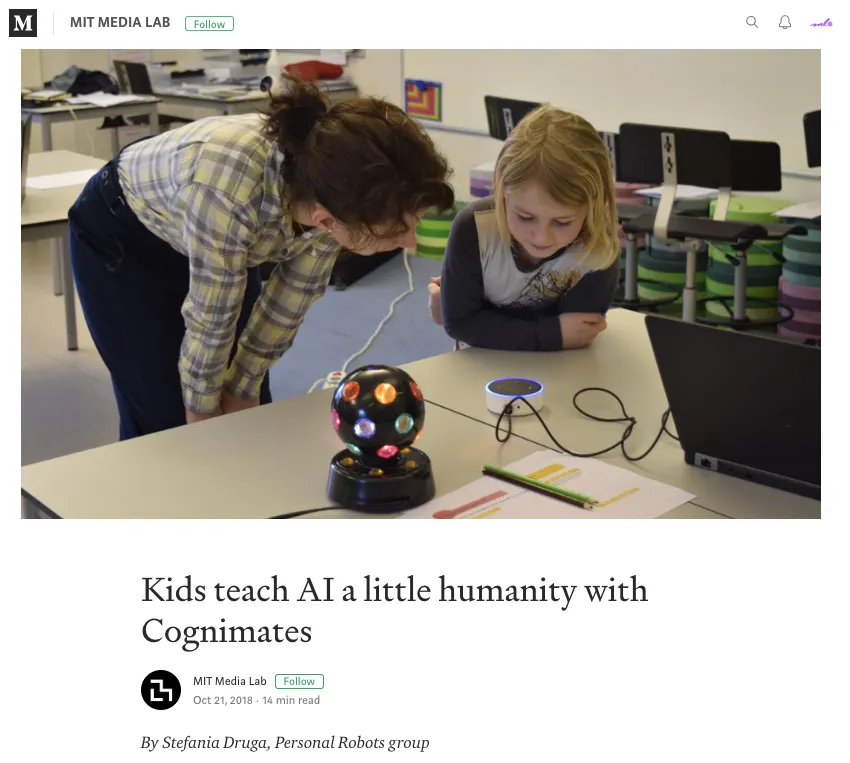

_Originally published at on Medium in on Feburary 12, 2019._

# In Conversation with ITP SIR Stefania Druga
At ITP, the list of career goals is long, ambitious and, some might also argue, lofty. Being a Lego Fellow would be cool, incubating a project at the MIT Media Lab would be a dream, contributing to the world of tech ed would be meaningful, etc. Few of us live to check all of those off the list! This, alongside a passionate drive to make the world a more accessible place, is what makes Stefania Druga such an impressive and vital voice in the field of innovative tech. You may recognize Stefania from her TEDx on creative making for social impact, her work on the team that developed Scratch, or most recently from the hallways of the ITP floor! Stefania Druga is the creator of Cognimates, a platform for AI education, and a newly minted adjunct professor and Something in Residence (SIRs) at ITP. I sat down with Stefania to chat about her goals for the semester and the insight that she brings to the landscape of AI and machine learning for kids.

If you like this conversation as much as I do, then you’re in luck! Stefania is generously letting us peek into her world with two more Medium check-ins before the semester is up! Follow us here or on Twitter for updates.

> — Ashley Jane Lewis, 1st year ITP student and ml5 Community Manager Research Assistant

**ml5:** There’s a lot of buzz on the ITP floor around your class and research. We’re really happy to have you here! What are you hoping to explore in your residency this semester?  

**Stefania:** A lot of my previous research at MIT and, more recently, in my residency in Germany, was focused on demonstrating the impact that Alexa and smart toys are having on kids. There is a lot of critique on existing systems like Google Home but there are no alternatives. The main inspiration and motivation for my residency and my class, [Hacking Smart Toys for AI Learning](https://itp.nyu.edu/classes/listings/2019/hacking-smart-toys-for-ai-learning/), is to try to propose alternatives to smart toys and connected devices that are focused on enabling kids to learn by doing. These could be kits, toys, learning activities, something physical, a digital experience, a crossover — anything that enables kids to learn about machine learning and AI through play. I’m excited to work with the ITP students! Most of them want to design something for their younger brother or sister.

We’re using human-centered design to approach this from a child’s perspective rather than a technological perspective. There’s a lot to work with. You know, toys are not new. We’ve had toys since the antiquity. In doing research for this class, I’ve learned so much about toy history. It didn’t used to be gender separated, for example. We used to have toys that were much more neutral! Over the time we’ve created this blue isle and pink isle and people are starting to raise issues about that.

This class is a unique opportunity to enable the students to work and co-design with kids. In being embedded in communities of educators and families we’ll try to discover their questions, their insights, how kids like to play and how can we _enhance_ that play. Instead of saying that every doll or toy should be connected or smart, our findings might show that we need to have disobedient toys, irrational toys or maybe that it is just too early to put an Alexa in the nursing room. This class is meant to be a critical exploration of current technology while posing alternatives.

**ml5:** That’s so interesting. What I like is that it doesn’t sound as though the curriculum is pre-supposing what the positive or negative implications of AI are on kids. You’re going to figure it out together.  

**Stefania:** Exactly. We’ll discover that as a class. I definitely feel like it’s going to be a learning experience for me as well. I’m used to working with kids and mentors but I’ve never taught graduate students to design devices so it’s going to be amazing because we’ll be exploring this together. I’ve been very open to their feedback and contributions. Just like the kids, as soon as you give people a voice and a platform for them to express all their questions, concerns and ideas, it’s amazing what they come up with!

**ml5:** It sounds like you’re allowing your students to build a strong sense of agency over their work, similar to the ethos behind your research.  

**Stefani:** Yes, absolutely! I would encapsulate as “hard fun”. [Papert](http://www.papert.org/articles/HardFun.html) came up with this concept. It’s the idea that, when you teach something to kids, you don’t need to dilute it or dumb it down. You only need create entry points to make it accessible by capturing the essence of concepts that they’ll come across or big questions that they will explore. That’s what I’ve told the students — this is going to be _hard fun_; we’re going to have fun but it’s also a lot of work because we’re wearing many different hats.

> We’re researchers, engineers, educators, family members, all of the above!

The residency is really continuing the work that I’ve done at [MIT](https://www.media.mit.edu/projects/cognimates/overview/). [Cognimates](https://mitmedialab.github.io/cognimates-website/about/) is the open source platform I created that is meant to be used for AI education. I did [a demo on Dan Shiffman’s channel, The Coding Train,](https://www.youtube.com/watch?v=U220GvNu1TY) which was hilarious because I didn’t prepare it at all and I had no idea how popular his channel is. _\*laughs\*_ A lot of things broke in the demo! [Cognimates](https://mitmedialab.github.io/cognimates-website/about/) runs in the browser and we have to fix things that break all the time. It was crazy and probably one of my worst demos ever but a lot of teachers and educators have watched it so I’d love to tap into Dan’s expertise and further explore the creation of those type of tutorials. I feel like there’s such a void and gap. Everyone talks about AI but, especially when you look at it from an educator, child or parent perspective, there is very little informative content out there.

[Click here to read and listen to the interview.](https://www.cbc.ca/radio/thecurrent/the-current-for-january-30-2019-1.4998405/how-should-parents-talk-to-their-kids-about-ai-devices-1.4998422)

**ml5:** — And there’s a lot of fear.  

**Stefania:** There’s a lot of fear! My approach, which is coming from a background of hands on learning and constructivism, is always very project based. I’ve been working with kids for the past twelve years and I’m always like, “let’s hack it! What do we have? How do we put it together? What do you like? What are you into? Oh, you like video games? Great, how can you make your own video games?” I bring that approach to AI and machine learning. I see it as a new medium for creation and learning.

It’s not just this fear driven narrative. For journalists, it sells stories and it’s easy to tell but it’s not really what’s going on here. I’m constantly talking to journalists, telling them that there’s more nuance to this so let’s dive deeper and be more open. Why not give kids a voice? This is going to be _their_ technology and _their_ generation so we should just let them explore and see what they come up with.

**ml5:** Yeah, there needs to be space to engage in productive conversations about machine learning. Which mediums are you using to challenge these social norms and assumptions around AI this semester?  
Stefania:** There are two major things. Firstly, I’m working on a book because I don’t expect people to read my 240 page academic MIT thesis. _\*laughs\*_ I want to translate those stories into a book for parents, kids and families that demystifies AI, asking questions around what we can actually do with these things and how we acquire agency with them. Each chapter will come with a story about what I’ve observed or researched and then focus a project that they can do at home. The book is interactive, so you can play the projects online or download them onto a tablet. It’s designed to allow people to try out the projects, even if they don’t get the book. I think it would be cool to even integrate some of the projects or findings from the AI Toy Hacking class at ITP!

And then the other thing I’m focusing on is the Youtube channel. Since I already need to prepare for class each week, it would be great to capture the process and document how we go about hacking certain devices or how we use AI lego, for instance. I would say that these would be the two main deliverables for my residency.

**ml5:** That’s exciting because I can’t think of a parental resource or guide that meets that informational need right now. That’s a wide open world.  

**Stefania:** Yeah and I think it’s also psychologically and philosophically interesting at the same time. In my thesis I did [longitudinal studies](https://en.wikipedia.org/wiki/Longitudinal_study) which meant six weeks of observing public schools, private schools and community centres every day, across all socioeconomic backgrounds, cultures and levels of exposure to technology. This was a way to gauge how kids’ perception of AI devices and toys changes when they learn how to program them and train them. In the beginning they were like, “oh AI is super smart, it’s super friendly, it remembers me,” and then, once they learned how they actually work, and they were able to program their own AI and their own classifiers they were like, “oh no, it’s not that smart”. _\*laughs\*_

**ml5:** Wow, that is absolutely fascinating!  

**Stefania:** Yes, because this really shows what happens if we demystify some of the underpinning and black box of AI. Toys are easy to start with because they’re fun and kids love toys but some of these toys are a little bit like Frankenstein. They have cameras, they’re recording your voice and it’s not clear what gets recorded or where it’s shared. It definitely gives us a lens into society. This will be the first generation that is going to take AI for granted, just as we took the internet for granted. Your 4 year old is going to grow up with a habit of talking to everything! What does that do and how does that change the way we talk to our peers and our parents? Since some of these devices are social robots, they express emotions and they’re made to connect or, at least, simulate connections. It really makes you wonder, how are we different?

**ml5:** Right, because that reflection is going to shift the way we interpret our own emotions.  

**Stefania:** Yes. When you have those deep conversations with kids you realize that AI technologies are just metaphysical objects that trigger this kind of deep self-reflection. For instance, if we make music with a computer, how do we _define_ music in the dataset? What kind of samples do we use and where do we get those samples? I really like how deep we have to go in knowing ourselves and knowing our practices in order to define those practices. This “knowing”creates a kind of repository of knowledge and purpose.

**ml5:** It’s like a high definition mirror. You really have to figure out who we are what we want to be which is so acutely true of kids. Kids have a much more uninhibited identity. They acutely know who they are and can express themselves freely.  

**Stefania:** Their genuine radar is amazing which is why I love working with kids because they always say what they think and they’re spot on! You can’t fake it with a child and as a educator is actually a lot was pressure. If you go in with something bothering you, kids will pick it up. So in that way, kids are actually _really_ good at asking the right questions and giving their opinions in meaningful ways.

**ml5:** The ambition to crack open the black box, as you said, is so imperative to showing kids how to be more than just a consumer of technology. There are so many ways to use AI to do this.  

**Stefania:** It’s been interesting. I’ve realize that by the time this generation reaches the job market, even the way we define what a developer _is_ is going to change. It’s a literacy. There needs to be an AI literacy as well because the worrisome part is that these algorithms and systems are embedded everywhere — from your college application to your loan application to your ZIP code. I just recently read this book called _Weapons of Math Destruction._ I very much empathize with it because I think that these massive scale algorithms are affecting the people in need more than anyone else.

Preparing a child for the future needs to include an understanding of the giant gap because this digital divide will only get amplified with machine learning influences. Even if that child doesn’t go on to work in tech, they will still need to have this literacy because we all have these phones in our pocket and you need to know the essentials like privacy and the ways in which data is currency. So how do we overcome that?

**ml5:** I’m fascinated by the ways in which kids see themselves in correlation to AI. What _are_ these devices from their perspective? Do you find that kids see AI as a peer or is it more like a object of authority?  

**Stefania:** It definitely depends on whether they have an Alexa or connected device at home. The cultural difference is important as well. In my research I would ask them if the AI is more like a teacher, a pet, a friend, a person they can trust, etc — all of these questions to map out how they perceive and position themselves next to technology.

I can tell you that kids and parents in Germany are much more skeptical about AI. There’s a general mistrust of the technology and many questions around what is happening to the data. I did a workshop with thirty families and none of them would put it in their home because they didn’t know how it would affect their child’s behaviour or how it would impact their development. This is a very different approach than what you get here in America. It’s pushed so hard here that there are approximately 47 million in homes which is estimated to grow to over half the population by 2020.

It bothers me because the first thing that journalists ask me about when discussing kids and AI are questions about Alexa. Alexa, to be clear, is a commercial device that was primarily designed to sell things. Using this as our only reference point becomes problematic because it will shift the expectation of what the technology could do. That’s why, in my class and generally in my research, I am trying to propose alternatives. Machine learning and AI is so much more than Alexa and I think this awareness is something that I’d really like to push with my residency.

This is the battle we’re up against. I think that some of my students feel small next to these big companies like, “Amazon is so big! what could we possibly do to change things?” Actually, we can do a lot! Look at Europe, they have good regulations, policies and research. You can actually make the corporations change their practices. We shouldn’t underplay the role of good design and good guidelines because that work makes meaningful impact across all different disciplines.

**ml5:** Right, because at the end of the day, these corporations create products that intend to make money. If the public discourse switches to reveal that their services do not reflect what people will need, want or buy, then those corporations will also feel pressure to switch their applications of AI and machine learning.  

**Stefania:** Absolutely. By informing people and guiding the conversation, we can do a lot. Large corporations want to do what the mass amount of users want. The first paper I published in 2017 on the topic was about making the recommendation that there should be more focus on behavioural interactions. We thought kids should be polite to Alexa because, if they’re rude to it, they might start being rude with their friends. Then Alexa included a please and thank you function! This wasn’t just as a result of our paper, I’m sure there were other studies showing similar things, but it was proof that research and conversation can make a difference. We can do so much more!

[Click here to read the article.](https://medium.com/mit-media-lab/kids-teach-ai-a-little-humanity-with-cognimates-e812aa91e221)

**ml5:** I feel all fired up! How can people get involved? Would you like help from ITP during your residency?  

**Stefania:** Yes definitely, across all fronts! Our platform is open-source so people can contribute to it, repurpose, or reuse it in their classrooms or projects. I’d love for people to make more learning resources or translate the ones that already exist. Speaking to toy designers, interaction designers or members of the toy industry would also be great. They need to be a part of these critical discussions as well.

**ml5:** It sounds like it might be helpful to have people on the team who work in video production for your Youtube channel as well.  
Stefania:** Yes, that or they could demo their projects, interview kids, etc., The more the merrier. I’m also happy to co-author papers or blog posts.

> “I think doing the work is just as important as democratizing and sharing the work, especially in this new field.”

**ml5:** Wow, there are so many ways to contribute. This is such a large project, I can’t wait to see how it evolves. It’s so ambitious!  
Stefania:** Yes, you’ll come to discover that I’m a bit crazy! _\*laughs\*_ The ITP students are very ambitious too. One of my students is having a baby and is building a AI reading app! This is just so beautiful because there’s really nothing better than designing something for your future child. (Stay tuned for more info on _Let’s Read a Story_, a super cool ITP project! For now, check it out [here](https://letsreadastory.herokuapp.com/)).

I can’t wait to touch base again to discuss the findings from the class. They have come with a multitude of perspectives and I’m pleased to see that they are so focused on having conversations about ethics. I’m really excited about this place. It’s great to be in an environment where the students and educators are so passionate.