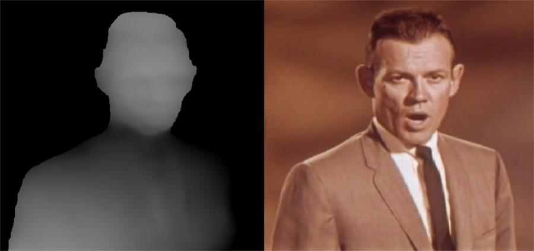
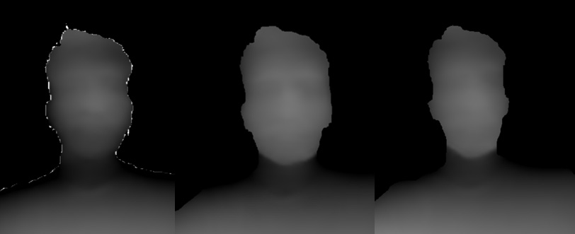
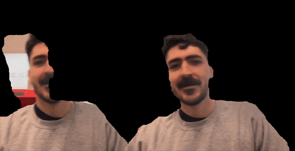
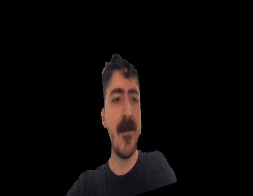

There is something very alluring about having the computer see the world, not just as pixels, but as space and volume. [Machine learning has been racing towards this hefty goal](https://medium.com/@patriciogv/the-state-of-the-art-of-depth-estimation-from-single-images-9e245d51a315) of depth estimation: turning photographs, videos or live camera streams into three dimensional data without the need of specialized equipment. While a lot of this is happening in python, depth estimation in the browser can leverage javascript's 3D creative coding tools, like p5.js's WEBGL renderer and the new [p5 2.0 strands](https://www.davepagurek.com/blog/writing-shaders-in-js/)!

As part of ml5's 2025 summer research, I worked on bringing depth estimation to the library under the mentorship of Dan Shiffman and building on the work of Alan Ren. In this article, I'd like to share some of the highlights and features of how this was done, why certain decisions were made and what things may come next for ml5 and depth estimation!

## Choosing a Model
For this first implementation of depth estimation in ml5, we decided to use tensorflow.js's [ARPortraitDepth](https://blog.tensorflow.org/2022/05/portrait-depth-api-turning-single-image.html), a model created to estimate depth exclusively on portrait images. Although it's not the latest or most flexible solution, this model is highly optimized for fast in-browser performance, which makes it a great asset in real-time interactive code sketches. This compromise of speed over accuracy felt appropriate for an initial implementation, setting the stage for future higher-accuracy lower-speed depth models in ml5.

## Making Depth Maps with ml5
The `depthEstimation` module takes in an image or video and returns an estimated *depth map:* an image where each pixel's color is mapped to an estimated z value. By default, ml5's depth map uses grayscale RGB pixel values in the range of `0 - 255`, where `0` is farther and `255` is closer.



For a good starting point, check out the [depthEstimation Webcam Example](https://editor.p5js.org/nasif-co/sketches/Pep6DjEtD).

## Cleaning Up the Edges
<!-- Talk about the dilation filter -->
One of this model's issues is in correctly estimating depth for the contours of a person. Often in these ambiguous edges, the estimated depth map contains erratic and innacurate values that need to be filtered out. To make this process easier, the `dilationFactor` option was included:

```js
  depthEstimator = ml5.depthEstimation({
    dilationFactor: 4; // 4 pixels by default
  });
```

This option sets how many pixels around the detected edges of a person should be ignored when estimating depth.

For example, with a value of 4, all depth values within 4 pixels of the contour are discarded. By changing the value, more or less data around the contours can be ignored, depending on how inaccurate the estimated edges are at any given time.



## Keeping Data in Sync
As sketches using depth estimation get more complex, they take longer to process and draw. If our code runs slower than the source video's framerate, the video will move on to the next frame before we finish drawing for the current frame. The result is that we drew does not line up with the current video/webcam frame!



To combat this issue, the depth estimation result in ml5 includes a `sourceFrame` property. This holds the exact frame that was used to estimate depth values, which means it is always in sync with the depth map. By drawing using `sourceFrame` instead of the video or webcam feed, you can guarantee that what you draw will never fall out of sync with the input source. The video above uses `sourceFrame` on the right and just the video source on the left, so you can see the effect.

## WEBGL Renderer and 3D
<!-- The 3D examples like point cloud and mesh -->
By pairing depth estimation with p5's WEBGL renderer, the video or image input can be visualized and reimagined in 3D! The best way to get started with this is checking out the [Point Cloud](https://editor.p5js.org/nasif-co/sketches/VbT8hEoDz) and [Mesh](https://editor.p5js.org/nasif-co/sketches/X-e1DEZr4) examples.



## Paving the Way Forward
Having depth estimation available in ml5 at this time, when p5 2.0's WEBGL and shader capabilites are making it easier to work with 3D, is very exciting! I'm interested in exploring how depth maps can be reinterpreted through shaders by means of `p5.strands`, which will likely lead to making some new examples for ml5's depth estimation module.

Apart from this, I am especially drawn to the interest in incorporating newer, more accurate depth models. Next steps will focus on bringing these models carefully into this same API, making it easy for users to swap between models like it is done in other parts of the ml5 library. 

Most of all, I look forward to seeing the ways the p5 community will create and explore with these tools!
<br><br>


---
<span style="color: gray;">[Nasif Rincon](https://nasif.co) is a designer working with code, electronics and media. He is part of ml5's research team as a graduate student at NYU ITP.</span>
