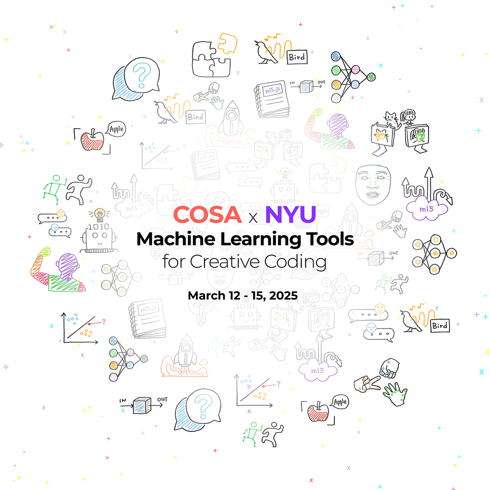

Join us at ITP for an informal series of talks and workshops exploring **open-source machine learning tools** for creative coding, presented in partnership with the **[Clinic for Open Source Arts](https://clinicopensourcearts.org/) (COSA)**!

 

--- 
#### **p5.comfyui-helper** with Gottfried Haider (NYU Shanghai)

📅 Wednesday, March 12th, 10:00am @ Room 450

 

--- 
#### **Transformers.js** with Joshua Lochner (Hugging Face)

📅 Friday, March 14th, 12:15pm @ Red Square

 

--- 
#### **Lightning Talks** with ml5.js contributors

📅 Friday, March 14th, 1:30pm @ Red Square

 

--- 
#### **How to Contribute to ml5.js** with Open Source Club @ITP/IMA

📅 Saturday, March 15th, 1:30-4pm @ Room 426

 

*Stay tuned! More details coming soon!*