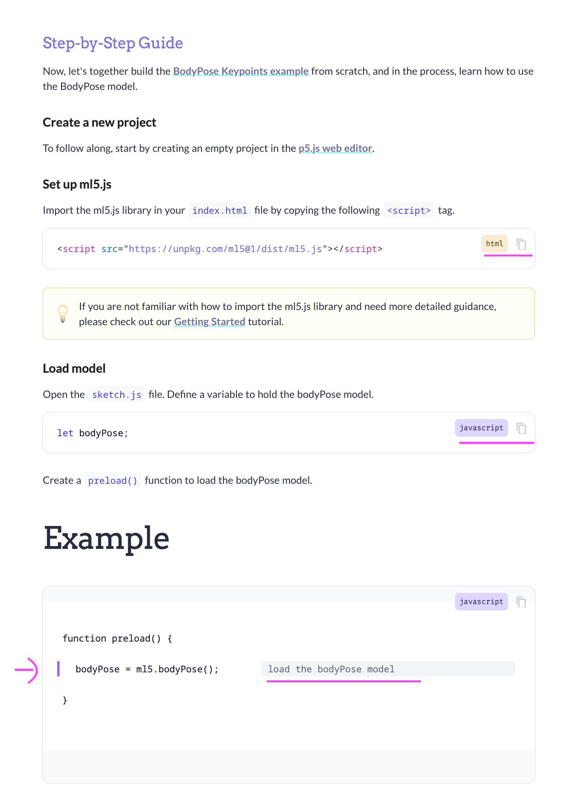
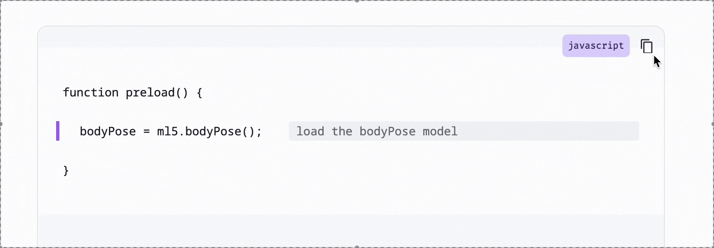

This summer, I contributed to the [ml5.js](https://ml5js.org/) open source project with a focus on improving the website’s contribution flow, documentation UX, and exploring creative applications of machine learning in the browser. My work spanned both technical and community-facing aspects of the project, giving me deeper insight into what it takes to support and sustain an open source ecosystem like ml5.

---

### 📮 Contribution Form Redesign

One of my primary contributions was designing and implementing an updated **contribution form** for the ml5.js website. The goal was to streamline how community members submit their creative work, projects, and tutorials. I focused on improving:

- Accessibility and clarity of the form
- Restructuring the input fields
- Submission flow UX

I collaborated closely with Moon and worked within the Gatsby-based architecture to ensure it matched ml5’s voice and contributor experience. I also had the chance to review project submissions, gaining a broader sense of how diverse users engage with ml5.js.

---

### 💬 Inline Code Explanation Plugin

Inspired by learners who thrive with embedded guidance, I built a custom **Docsify plugin** that adds inline explanations to code blocks. It uses a simple syntax where code and explanation are split with a `|`:

```code-comment js
let classifier = ml5.imageClassifier('MobileNet') | initialize the classifier
classifier.predict(gotResult)                   | run prediction callback
```

The plugin transforms this into semantic HTML:

```html
<span class="highlight-line" data-code="..." data-comment="..."></span>
```

Wrapped in a stylized container:

```html
<pre class="code-comment-wrapper" data-lang="js">
  <code class="language-code-comment">...</code>
</pre>
```

Here’s the parser plugin logic (using Docsify’s `beforeEach`):

````js
hook.beforeEach(function (content) {
	return content.replace(
		/```code-comment\s*(\w+)?\s*\n([\s\S]*?)```/g,
		(match, lang = 'code', rawCode) => {
			const lines = rawCode
				.split('\n')
				.map((line) => {
					const [code, comment = ''] = line.split('|');
					const safeCode = code
						.trim()
						.replace(/&/g, '&amp;')
						.replace(/</g, '&lt;');
					const safeComment = comment
						.trim()
						.replace(/&/g, '&amp;')
						.replace(/</g, '&lt;');
					return comment
						? `<span class="highlight-line" data-code="${safeCode}" data-comment="${safeComment}"></span>`
						: `<span class="normal-line" data-code="${safeCode}"></span>`;
				})
				.join('\n');
			return `<pre class="code-comment-wrapper" data-lang="${lang}">
<code class="language-code-comment">\n${lines}\n</code></pre>`;
		}
	);
});
````



---

### 📋 Copy-to-Clipboard Plugin

The second plugin I built adds a **copy icon** to all code blocks (including the above inline format). When clicked, it copies the _raw code only_ (without comments) and shows a `Copied!` toast.



This uses the `doneEach` hook and dynamically appends buttons and toasts to rendered blocks.

---

### 🍯 Neural Nectar: A Parallel Exploration

Alongside my work on documentation, I also began prototyping [**Neural Nectar**](https://github.com/yafira/neural-nectar), a tiny series series of browser-based creative ML experiments using ml5.js + p5.js. Each sketch focuses on soft, poetic, or playful interactions—such as gesture-drawn flowers or reactive ambient sound environments.

My goal is to use these experiments to:

- Explore alternative interfaces for ML
- Build aesthetics of _soft interaction_ and curiosity
- Deepen my understanding of ml5 model behavior

---

### 🎐 Reflections

This was my first time contributing to a large open source library from the inside. I learned:

- How documentation systems like [**Docsify**](https://docsify.js.org/#/) and [**Gatsby**](https://www.gatsbyjs.com/) work together
- How contributions, no matter how small, ripple outward in community projects
- That open source isn’t just about code — it’s about infrastructure, clarity, and participation

Contributing to ml5 gave me a deeper appreciation for the _design of access_ — making ML tools not only functional but **friendly**, inclusive, and full of wonder.

> “How can we build tools that not only work well, but also invite play, experimentation, and delight?”

---

### 🌸 Gratitude

Huge thanks to Moon, Dan, and the entire ml5 community for their generosity, mentorship, and creative energy. I'm honored to have played a small part in helping ml5 grow, and I look forward to continuing the journey.
