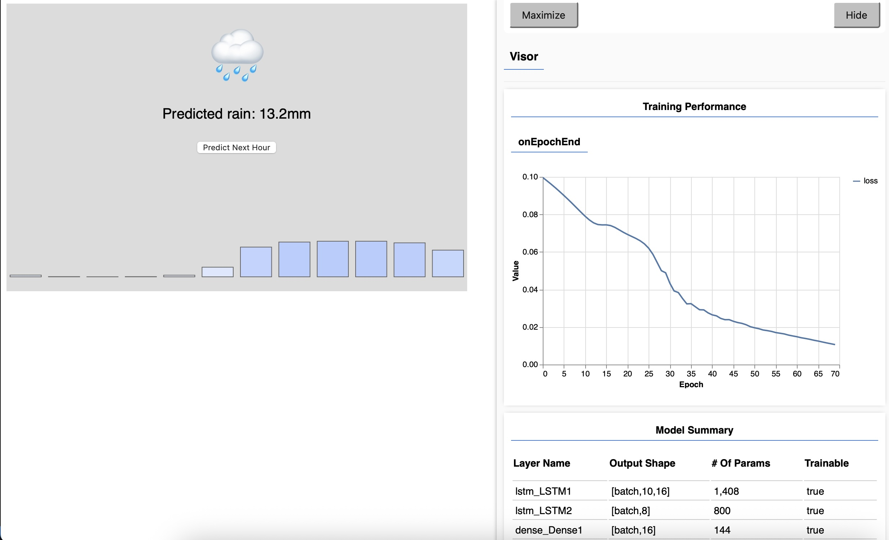
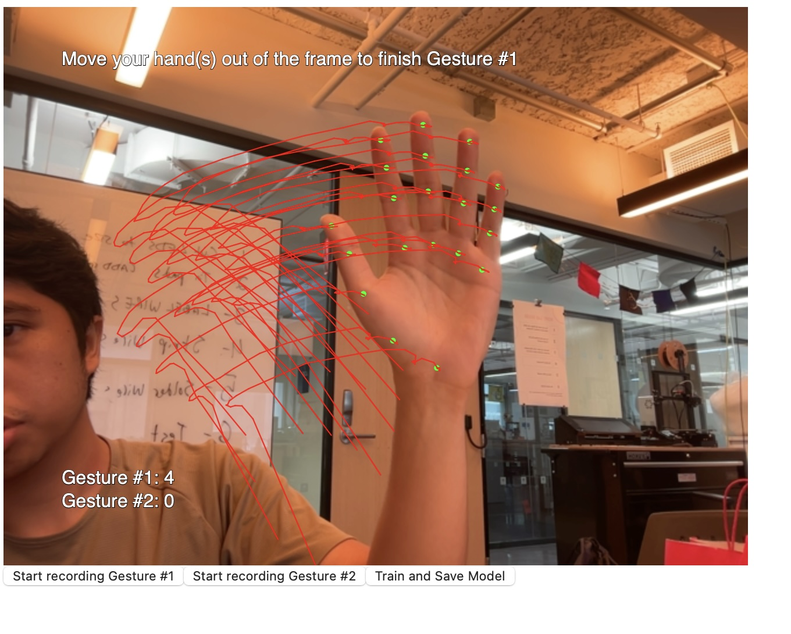
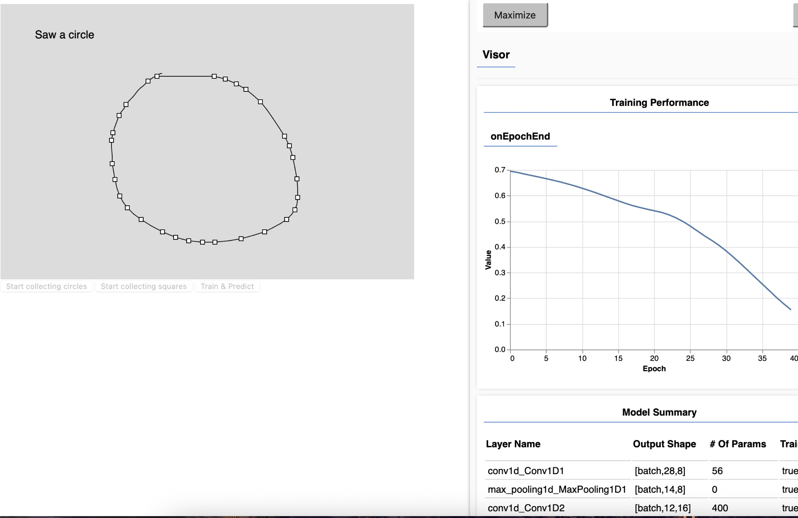

# Sequence Neural Network Summer Updates

This documentation includes work/research done during the summer ☀️.

Please refer to the PR here: [link here](https://github.com/ml5js/ml5-next-gen/pull/252)

Or try yourself using this branch: [link here](https://github.com/ml5js/ml5-next-gen/tree/timeseries-base)

During the summer some work was done towards the following aspects:

- TimeSeries -> Sequence
- Helper Functions
- Examples
- Better Error Handling

## TimeSeries -> Sequence

### Renaming the Class

At this time, TimeSeries got a new name for more clarity, it is now called Sequenctial or Sequence Task. This makes a lot more sense as the main usecase of this feature is not focused on time itself but the structure/sequential nature of the data.

### Class to Task

In addition, instead of being its own class, it is now a task of the neuralNetwork itself. An example can be seen below:

```js
// timeSeries as its own class
let options = {
  task: "Classification",
  spatialData: "true",
};
let model = timeSeries(options);

// sequence as a task of neuralNetwork
let options = {
  task: "sequenceClassificationWithCNN",
};
model = ml5.neuralNetwork(options);
```

Seen from the example above, the task defines three things:

1. **sequence** : defines the task to use this feature
2. **Classification** : the typical ml5 task people are used to (classification vs. regression)
3. **WithCNN** : to switch on the toggle of spatial data (for coordinate based data)

A list of possible choices are seen below:

- sequenceClassification,
- sequenceRegression,
- sequenceClassificationWithCNN,
- sequenceRegressionWithCNN,

### Choose Backend according to task

Since the sequence task is a class that extends from the `neuralNetwork()` class, some work was also done to allow the backend to choose between using the base NN class or the extended sequence class.

This was done through creating `taskSelection.js` where it imports the factory functions of both classes and runs whichever the task refers to.

## Helper Functions

During this period some helper functions were also improved.

### getSlidingWindow()/getSampleWindow

This automatically does a sliding window algorithm to an array of data. The user can choose the size and inputs/outputs to keep and add to the model. Those options are then used to get a sample based on the previous function

This summer it was renamed to a verb for clarity

### setFixedLength()

This allows an **RDP (Ramer–Douglas–Peucker) algorithm** to decimate extra points from a set of ordered coordinates. Along with some extra padding/slicing, this allows any data with variable length can be simplified to a target length.

```js
let inputs = model.setFixedLength(sequence, sequenceLength);
// changes the size of the array to a fixed value
let outputs = { label: curShape };
model.addData(inputs, outputs);
```

This used to be called `padCoordinates()` but was changed to the current name to clarify its purpose (the naming is not final yet)

This was developed before the summer but was only available for a single (x,y) coordinate pair. This sumer, it was implemented to allow several coordinate pairs as long as it follows the pattern `[x1,y1,x2,y2...]`. It makes it possible to extend the use of the function to other ml5 models that return many points such as `faceMesh`, `handPose`, `bodyPose`, etc., lessening the extra step for users in limiting the sequence lengths.

## Examples

During the summer some work was also alloted to simplifying and fixing the examples. This takes into account the user facing side both in the example itself and how the code was written.

### Weather Prediction



This example was reworked several times in different ways:

- Adding the created getSlidingWindow helper function, and cleaning up unnecessary code
- UI changes that shows a bar graph similar to weather stations
- Open coding the sliding window algorithm and some code cleanup(thanks to gohai!)

Some work was also put in experimenting with real weather data using several weather API's (instead of generated toy data). However it was difficult to predict/generate meaningful data without complicating the model by a lot.

### Hand Gestures



- Instead of instruction text at the bottom, the instructions are now based on the current state that the user is interacting with the example
- Added the newly possible `setFixedLength()` simplifying the example code more
- Added UI elements of the rdp algorithm to clarify how points change as the sequence lengthens (thanks to gohai!)

### Mouse Gestures



- Simplified the styling for code simplicity
- Added UI elements of the rdp algorithm to clarify how points change as the sequence lengthens (thanks to gohai!)

## Better Error Handling

Along with the aforementioned changes, there was also some work around making some error messages friendlier and clearer.

## Acknowledgements

- A lot of thanks to Professor Gottfried for the guidance during this period, he also did a lot of coding to get the examples to be as nice as possible
- Also special thanks to Professor Dan and the rest of the ml5 team for their help and feedback
