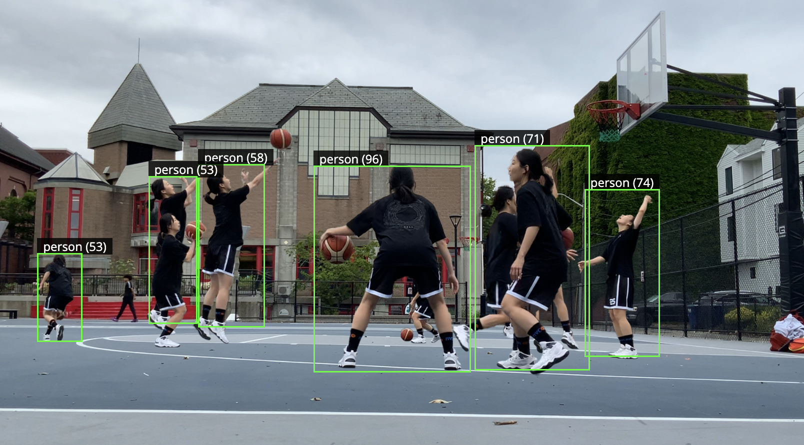

## Introduction

This Summer 2025, I had an opportunity to work with the ml5 team and my mission was to bring back object detection to ml5. Object detection was not included in ml5 1.0 for maintenance issue, which left some users asking for its return.

](./images/issue.png)

In this post, I want to share my journey. I hope this serves as a helpful resource to any future contributor, especially those who are new to open source projects.

## Deliverables
Here's a list of deliverables :

- [Code] A refactored [legacy code](https://github.com/ml5js/ml5-library/tree/main/src/ObjectDetector) that works with ml5 1.0 and is scalable to include more models like Transformers.js
- [Code] Example p5js codes for 3 types of source : webcam, image, video.
- [Docs] Object Detection Docs for ml5 reference website.

For anyone interested, please take a look at the full [Pull Request](https://github.com/ml5js/ml5-next-gen/pull/257).

## Process

During the first half of the research, I focused more on understanding the fundamentals of machine learning. I took this time as an opportunitiy to revisit concepts introduced in Daniel Shiffman's class called [ML for Creative Coding](https://github.com/shiffman/ML-for-Creative-Coding).

 

Here are some of the things I made :

[Demo of Tensorflow.js Cocossd] The purpose for this demo was to make things explicit. So I distinguished the three file types and displayed raw data.

 

[Interactive Animations] I found machine learning concepts rather abstract, so I tried to demystify them by turning them into interactive sketches.

## Next
As the role continues into this coming fall, here are a list of things I will be focusing on :

- [Code] Introduce more models (Transformers.js) into Object Detector.
- [Docs] Research further and make suggestions about including [ml5.js Model and Data Provenance Section](https://github.com/ellennickles/ml5js-model-and-data-provenance-project) section on the website.
- [Docs] Internal doc for the dev team (esp. for onboarding)
- [Code] Create examples / projects with Object Detector (esp. in the domain of Sports)

 

I hope ml5.obejctDectector helps and inspires more people to view and use machine learning as a creative tool!

 

---
[Yujin Yi](https://codingeffects.com/) is a frontend developer and a sports enthusiast. She is part of ml5's research team as a graduate student at NYU ITP.