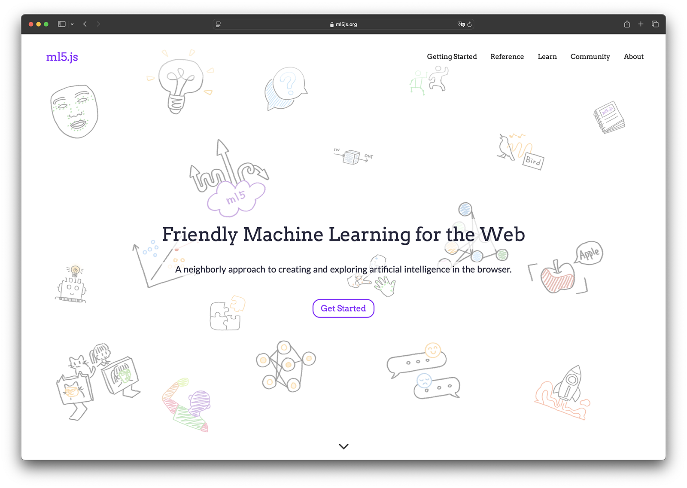
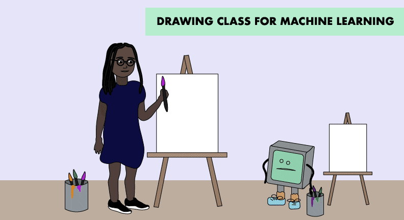
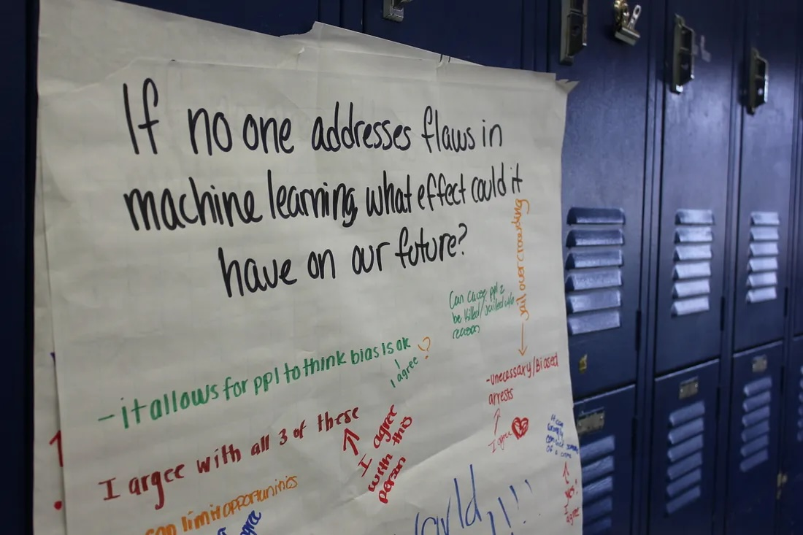
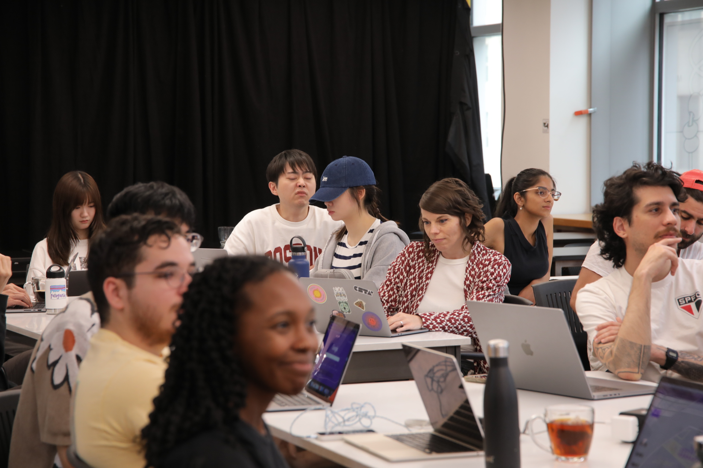

## Introduction

In August 2024, the ml5.js team released version 1.0, known as ml5.js "next generation." This release represented a significant transformation of the library, featuring updated models, the deprecation of unmaintained or rarely used features, and simplification and consistency improvements to the API. Below, you'll explore more about the history of ml5.js, details of the release process and updates, and ways you can join the community to shape the library’s future!

## Before 1.0: Launching ml5.js

<figcaption>animated comic from 2018 ml5.js launch by Elizabeth Ferguson</figcaption>

The ml5.js project launched in 2018 with a mission to bring a friendly, approachable, and inclusive perspective to machine learning within the creative coding community.

This first release aimed to help students both learn both the fundamentals of training machine learning models as well as explore creative, experimental, and educational applications of pre-trained models, without needing extensive prior knowledge. The library emerged from a collaboration with Google’s Big Picture Research Group, which provided crucial funding and research in developing deeplearn.js (which later became TensorFlow.js).

Drawing inspiration from p5.js and The Processing Foundation, the library was built first and foremost with beginners, students, and artists in mind. This first release featured pre-trained models like MobileNet for image classification and PoseNet for body tracking, along with a friendly API for training a custom neural network model with your own data.

What began as a project maintained by students, researchers, and faculty at ITP has blossomed into a worldwide collaborative effort.

## Building ml5.js next generation

Over the years, ml5.js expanded its capabilities, introducing new models like Handpose and Facemesh aligning the library with updates in TensorFlow.js. The 0.6.0 release in 2020 marked a significant leap with improved documentation, performance, and browser compatibility.

In 2021, [in collaboration with the Technology Law & Policy Clinic at NYU Law School](https://www.nyuengelberg.org/news/technology-law-and-policy-clinic-supports-ml5-js-in-developing-a-new-ethical-license-and-coc/), the ml5.js community took a significant step by formalizing its commitment to ethical machine learning applications through the introduction of a [new Code of Conduct and a dedicated software license](https://github.com/ml5js/Code-of-Conduct). This initiative aimed to ensure that projects utilizing ml5.js adhered to principles promoting positive and responsible use. Complementing this, the software license mandates compliance with the Code of Conduct, effectively linking ethical considerations to the legal use of the software.

In 2023, in collaboration with students and faculty at NYU Shanghai, development began on the "next generation" of ml5.js, emphasizing an upgrade to TensorFlow.js 4.22.0, integration of faster and more accurate models, improvements to the beginner-friendly API, and enhanced accessibility.

We’re excited to finally introduce ml5.js 1.0, a milestone release that we hope brings a fresh foundation for creative coding with machine learning.

## Releasing ml5.js 1.0

Below are highlights from the ml5.js 1.0 release, featuring contributions from NYU ITP/IMA and NYU Shanghai.

### Library Build and Technical Updates

- Created a new GitHub repository named `ml5-next-gen` for the 1.0 codebase, providing a fresh start to streamline development and simplify maintenance.
- Switched package management from NPM to Yarn for improved handling of TensorFlow.js dependencies.
- Updated the build system to Webpack version 5.

### A New Website

- Simplified the website's codebase by reducing external dependencies and technical complexity, making it easier for developers with basic web development experience to contribute and maintain.
- Built the main pages (Home, Learn, Community, About) using the Gatsby framework for improved performance and ease of updates.
- Utilized Docsify for model reference pages to enhance manageability and accessibility of documentation.
- Enhanced content and documentation to better support beginners:
  - Introduced a beginner-friendly "Getting Started" page with step-by-step instructions and illustrative screenshots.
  - Integrated live examples into reference documentation for immediate testing and feedback.
  - Provided detailed, line-by-line explanations of example code to ease the learning curve.
  - Created an approachable glossary defining ML/AI terminology to encourage broader community contributions.
- Adopted an inviting, hands-on creative visual style featuring illustrations by student artist Xiaozao Wang.

### Accessibility Updates

- Improved semantic HTML structure to enhance screen reader compatibility.
- Added descriptive alternative text to all images for better accessibility.
- Applied AAA contrast standards throughout the website to ensure readability and visual clarity.

### New and Updated Models

<figcaption>Bubble World by Sihan Zhang</figcaption>

- Upgraded to TensorFlow.js version 4.22.0, including WebGPU backend support starting from version 1.7.0.
- Replaced older models with faster and more accurate alternatives from MediaPipe and TensorFlow:
  - **BodyPose:** Multi-person detection with named keypoints and 3D coordinates using BlazePose.
  - **HandPose:** Multi-hand tracking with named keypoints and 3D coordinates.
  - **FaceMesh:** Multi-face tracking with named keypoints and 3D coordinates.
  - **BodySegmentation:** Enhanced segmentation quality with additional selfie segmentation capabilities.
- Introduced new `detectStart()` functions to manage continuous detection loops internally, simplifying model usage and preventing recursive loop issues.
- Continued support for core functionalities:
  - Image classification using MobileNet and Teachable Machine.
  - Sound classification.

### Ethics and Bias

- Updated the ml5.js [Code of Conduct](https://github.com/ml5js/Code-of-Conduct) to align with new features and functionality, reinforcing our commitment to responsible use and reducing potential for misuse.
- Read more about our ethical framework in the [Community Statement](https://ml5js.org/about/).

## What’s Next & How to Get Involved

Many of the updates for ml5.js 1.0 are ongoing, including work on the Code of Conduct, library and model updates, and more opportunities to share community resource on the website. All are invited to contribute to ml5.js!

- Looking for the old version or running into errors with ml5.js prior to 1.0?: Checkout our [FAQ](https://docs.ml5js.org/#/welcome/faq?id=what-happened-to-older-ml5js-releases) and related [Github issue](https://github.com/ml5js/ml5-next-gen/issues/167)
- Want to learn more about ml5.js?
  - Watch this [presentation by Aidan Nelson and Yu Lee](https://youtu.be/LHhSxtgyuUw).

Thank you to all contributors from the ml5.js community for making this release possible! contributing to this blog post.
